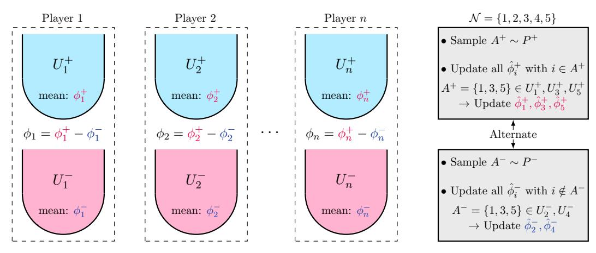
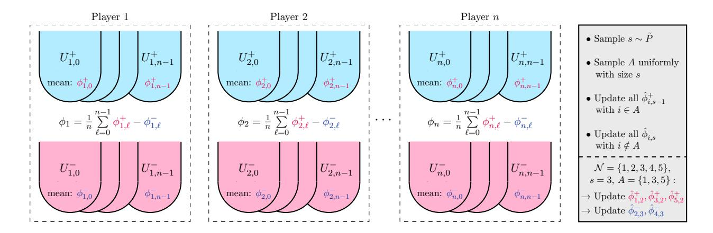
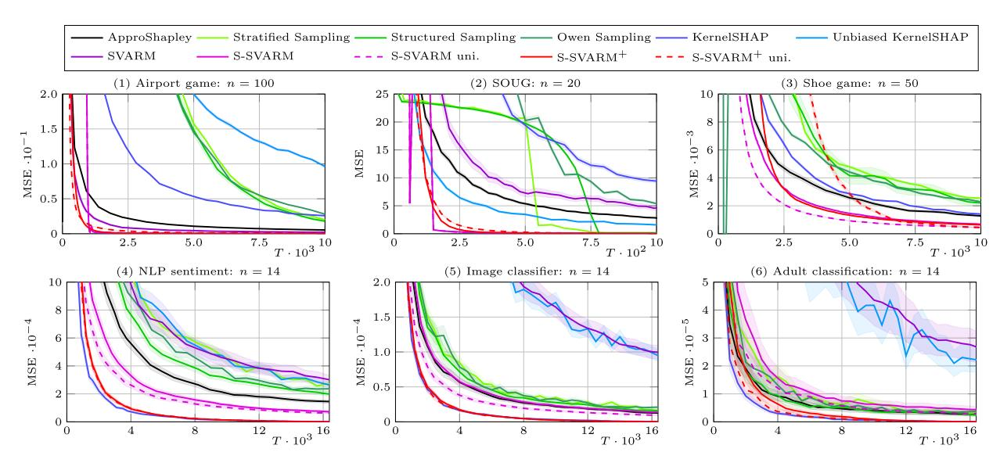
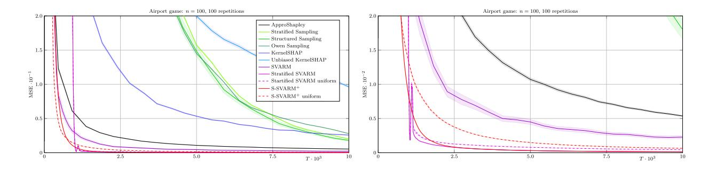
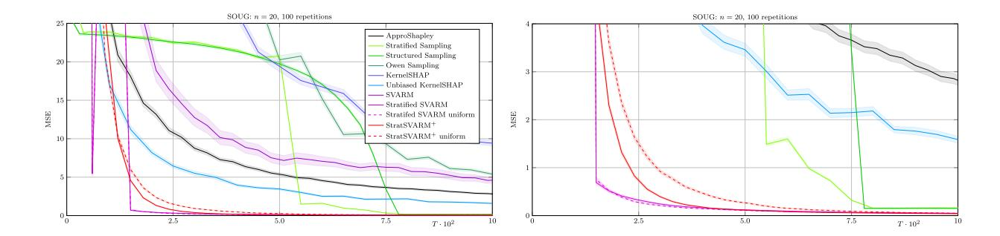
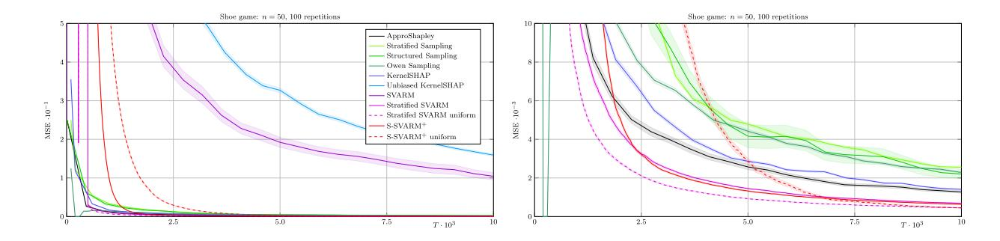
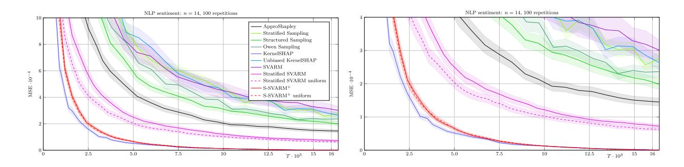
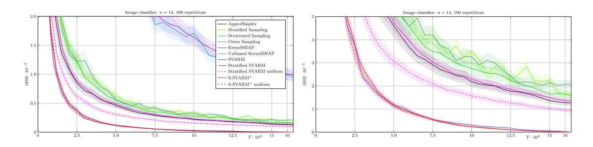
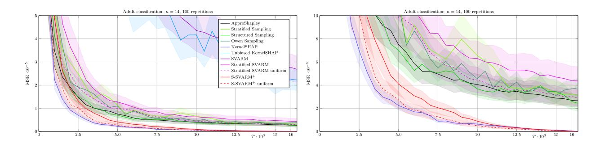

# APPROXIMATING THE SHAPLEY VALUE WITHOUT MARGINAL CONTRIBUTIONS

# Patrick Kolpaczki

Paderborn University patrick.kolpaczki@upb.de

Viktor Bengsa,b, Maximilian Muschalika,b, Eyke Hullermeier ¨ a,b a Institute of Informatics, University of Munich (LMU) <sup>b</sup>Munich Center for Machine Learning viktor.bengs@lmu.de, maximilian.muschalik@lmu.de, eyke@lmu.de

January 31, 2024

# ABSTRACT

The Shapley value, which is arguably the most popular approach for assigning a meaningful contribution value to players in a cooperative game, has recently been used intensively in explainable artificial intelligence. Its meaningfulness is due to axiomatic properties that only the Shapley value satisfies, which, however, comes at the expense of an exact computation growing exponentially with the number of agents. Accordingly, a number of works are devoted to the efficient approximation of the Shapley value, most of them revolve around the notion of an agent's marginal contribution. In this paper, we propose with *SVARM* and *Stratified SVARM* two parameter-free and domain-independent approximation algorithms based on a representation of the Shapley value detached from the notion of marginal contribution. We prove unmatched theoretical guarantees regarding their approximation quality and provide empirical results including synthetic games as well as common explainability use cases comparing ourselves with state-of-the-art methods.

# 1 Introduction

Whenever agents can federalize in groups (form coalitions) to accomplish a task and get rewarded with a collective benefit that is to be shared among the group members, the notion of *cooperative game* stemming from game theory is arguably the most favorable concept to model such situations. This is due to its simplicity, which nevertheless allows for covering a whole range of practical applications. The agents are called *players* and are contained in a player set N . Each possible subset of players S ⊆ N is understood as a *coalition* and the coalition N containing all players is called the *grand coalition*. The collective benefit ν(S) that a coalition S receives upon formation is given by a *value function* ν assigning each coalition a real-valued *worth*.

The connection of cooperative games to (supervised) machine learning is already well-established. The most prominent example is feature importance scores, both local and global, for a machine learning model: features of a dataset can be seen as players, allowing one to interpret a feature subset as a coalition, while the model's generalization performance using exactly that feature subset is its worth [Cohen et al.](#page-11-0) [\[2007\]](#page-11-0). Other applications include evaluating the importance of parameters in a machine learning model, e.g. single neurons in a deep neural network [Ghorbani and Zou](#page-11-1) [\[2020\]](#page-11-1) or base learners in an ensemble [Rozemberczki and Sarkar](#page-12-0) [\[2021\]](#page-12-0), or assigning relevance scores to datapoints in a given dataset [Ghorbani and Zou](#page-11-2) [\[2019\]](#page-11-2). See [Rozemberczki et al.](#page-12-1) [\[2022\]](#page-12-1) for a wider overview of its usage in the field of explainable artificial intelligence. Outside the realm of machine learning cooperative games also found applications in operations research [Luo et al.](#page-12-2) [\[2022\]](#page-12-2), for finding fair compensation mechanisms in electricity grids [O'Brien et al.](#page-12-3) [\[2015\]](#page-12-3), or even for the purpose of identifying the most influential individuals in terrorist networks [van Campen et al.](#page-12-4) [\[2018\]](#page-12-4).

In all of these applications, the question naturally arises of how to appropriately determine the contribution of a single player (feature, parameter, etc.) with respect to the grand collective benefit. In other words, how to allocate the worth  $\nu(\mathcal{N})$  of the full player set  $\mathcal{N}$  among the players in a fair manner. The indisputably most popular solution to this problem is the *Shapley value* Shapley [1953], which can be intuitively expressed by *marginal contributions*. We call the increase in worth that comes with the inclusion of player i to a coalition S, i.e., the difference  $\nu(S \cup \{i\}) - \nu(S)$ , player i's marginal contribution to S. The Shapley value of i is a weighted average of all its marginal contributions to coalitions that do not include i. Its popularity stems from the fact that it is the only solution to satisfy axiomatic properties that arguably capture fairness Shapley [1953].

Despite the appealing theoretical properties of the Shapley value, there is one major drawback with respect to its practical application, as its computational complexity increases exponentially with the number of players n. As a consequence, the exact computation of the Shapley value becomes practically infeasible even for a moderate number of players. This is especially the case where accesses to  $\nu$  are costly, e.g., re-evaluating a (complex) machine learning model for a specific feature subset, or manipulating training data each time  $\nu$  is accessed. Recently, several approximation methods have been proposed in search of a remedy, enabling the utilization of the Shapley value in explainable AI (and beyond). However, most works are stiffened towards the notion of marginal contributions, and, consequently, judge algorithms by their achieved approximation accuracy depending on the number of evaluated marginal contributions. This measure does not do justice to the fact that approximations can completely dispense with the consideration of marginal contributions and elicit information from  $\nu$  in a more efficient way — as we show in this paper. We claim that the number of single accesses to  $\nu$  should be considered instead, since especially in machine learning, as mentioned above, access to  $\nu$  is a bottleneck in overall runtime. In this paper, we make up for this deficit by considering the problem of approximating the Shapley values under a fixed budget T of evaluations (accesses) of  $\nu$ .

**Contribution.** We present a novel representation of the Shapley value that does not rely on the notion of marginal contribution. Our first proposed approximation algorithm *Shapley Value Approximation without Requesting Marginals* (SVARM) exploits this representation and directly samples values of coalitions, facilitating "a swarm of updates", i.e., multiple Shapley value estimates are updated at once. This is in stark contrast to the usual way of sampling marginal contributions that only allows the update of a single estimate. We prove theoretical guarantees regarding SVARM's precision including the bound of  $\mathcal{O}(\frac{\log n}{T-n})$  on its variance.

Based on a partitioning of the set of all coalitions according to their size, we develop with *Stratified SVARM* a refinement of SVARM. The applied stratification materializes a twofold improvement: (i) the homogeneous strata (w.r.t. the coalition worth) significantly accelerate convergence of estimates, (ii) our stratified representation of the Shapley value with decomposed marginal contributions facilitates a mechanism that updates the estimates of *all* players with *each single* coalition sampled. Among other results, we bound its variance by  $\mathcal{O}(\frac{\log n}{T - n \log n})$ .

Besides our superior theoretical findings, both algorithms possess a number of properties in their favor. More specifically, both are unbiased, parameter-free, incremental, i.e., the available budget has not to be fixed and can be enlarged or cut prematurely, facilitating on-the-fly approximations due to their anytime property, and do not require any knowledge about the latent value function. Moreover, both are domain-independent and not limited to some specific fields, but can be used to approximate the Shapley values of any possible cooperative game.

Finally, we compare our algorithms empirically against other popular competitors, demonstrating their practical usefulness and proving our empirical enhancement *Stratified SVARM*<sup>+</sup>, which samples without replacement to be the first sample-mean-based approach to achieve rivaling state-of-the-art approximation quality. All code including documentation and the technical appendix can be found on GitHub<sup>1</sup>.

### 2 Related Work

The recent rise of explainable AI has incentivized the research on approximation methods for the Shapley value leading to a variety of different algorithms for this purpose. The first distinction to be made is between those that are domain-independent, i.e., able to deal with any cooperative game, and those that are tailored to a specific use case, e.g. assigning Shapley values to single neurons in neural networks, or which impose specific assumptions on the value function. In this paper, we will consider only the former, as it is our goal to provide approximations algorithms independent of the context in which they are applied. The first and so far simplest of this kind is *ApproShapley* Castro et al. [2009], which samples marginal contributions from each player based on randomly drawn permutations of the player set. The variance of each of its Shapley value estimates is bounded by  $\mathcal{O}(\frac{n}{T})$ . *Stratified Sampling* [Maleki et al., 2013] and *Structured Sampling* [van Campen et al., 2018] both partition the marginal contributions of each player by coalition size in order to stratify the marginal contributions of the population from which to draw a sample, which leads to a variance reduction. While *Stratified Sampling* calculates a sophisticated allocation of samples for each coalition size, *Structured Sampling* simply samples with equal frequencies. Multiple follow-up works suggest

<span id="page-1-0"></span>https://github.com//kolpaczki//Approximating-the-Shapley-Value-without-Marginal-Contributions

specific techniques to improve the sampling allocation over the different coalition sizes [O'Brien et al., 2015, Castro et al., 2017, Burgess and Chapman, 2021].

In order to reduce the variance of the naive sampling approach underlying *ApproShapley*, Illés and Kerényi [2019] suggest to use ergodic sampling, i.e., generating samples that are not independent but still satisfy the strong Law of Large numbers. Quite recently, Mitchell et al. [2022] investigated two techniques for improving *ApproShapley*'s sampling approach. One is based on the theory of reproducing kernel Hilbert spaces, which focuses on minimizing the discrepancies for functions of permutations. The other exploits a geometrical connection between uniform sampling on the Euclidean sphere and uniform sampling over permutations.

Adopting a Bayesian perspective, i.e., by viewing the Shapley values as random variables, Touati et al. [2021] consider approximating the Shapley values by Bayesian estimates (posterior mean, mode, or median), where each posterior distribution of a player's Shapley value depends on the remaining ones. Utilizing a representation of the Shapley value as an integral Owen [1972], *Owen Sampling* [Okhrati and Lipani, 2020] approximates this integral by sampling marginal contributions using antithetic sampling [Rubinstein and Kroese, 2016, Lomeli et al., 2019] for variance reduction.

A fairly new class of approaches that dissociates itself from the notion of marginal contribution are those that view the Shapley value as a solution of a quadratic program with equality constraints Lundberg and Lee [2017], Simon and Vincent [2020], Covert and Lee [2021]. Another unorthodox approach is to divide the player set into small enough groups for which the Shapley values within these groups can be computed exactly Soufiani et al. [2014], Corder and Decker [2019]. For an overview of approaches related to machine learning we refer to Chen et al. [2023].

#### 3 Problem Statement

The formal notion of a cooperative game is defined by a tuple  $(\mathcal{N}, \nu)$  consisting of a set of players  $\mathcal{N} = \{1, \dots, n\}$  and a value function  $\nu : \mathcal{P}(\mathcal{N}) \to \mathbb{R}$  that assigns to each subset of  $\mathcal{N}$  a real-valued number. The value function must satisfy  $\nu(\emptyset) = 0$ . We call the subsets of  $\mathcal{N}$  coalitions,  $\mathcal{N}$  itself the grand coalition, and the assigned value  $\nu(S)$  to a coalition  $S \subseteq \mathcal{N}$  its worth. Given a cooperative game  $(\mathcal{N}, \nu)$ , the Shapley value assigns each player a share of the grand coalition's worth. In particular, the Shapley value Shapley [1953] of any player  $i \in \mathcal{N}$  is defined as

$$\phi_i = \sum_{S \subset \mathcal{N}_i} \frac{1}{n \cdot \binom{n-1}{|S|}} \left[ \nu(S \cup \{i\}) - \nu(S) \right],\tag{1}$$

where  $\mathcal{N}_i := \mathcal{N} \setminus \{i\}$  for each player  $i \in \mathcal{N}$ . The term  $\nu(S \cup \{i\}) - \nu(S)$  is also known as player i's marginal contribution to  $S \subseteq \mathcal{N}_i$  and captures the increase in collective benefit when player i joins the coalition S. Thus, the Shapley value can be seen as the weighted average of a player's marginal contributions.

The exact computation of all Shapley values requires the knowledge of the values of all  $2^n$  many coalitions<sup>2</sup> and is shown to be NP-hard Deng and Papadimitriou [1994]. In light of the exponential computational effort w.r.t. to n, we consider the goal of approximating the Shapley value of all players as precisely as possible for a given budget of  $T \in \mathbb{N}$  many evaluations (accesses) of  $\nu$  in discrete time steps  $1, \ldots, T$ . Since  $\nu(\emptyset) = 0$  holds by definition, the evaluation of  $\nu(\emptyset)$  comes for free without any budget cost. We judge the quality of the estimates  $\hat{\phi}_1, \ldots, \hat{\phi}_n$  — which are possibly of stochastic nature — obtained by an approximation algorithm after T many evaluations by two criteria that have to be minimized for all  $i \in \mathcal{N}$ . First, the mean squared error (MSE) of the estimate  $\hat{\phi}_i$  is given by

$$\mathbb{E}\left[\left(\hat{\phi}_i - \phi_i\right)^2\right]. \tag{2}$$

Utilizing the bias-variance decomposition allows us to reduce the squared error to the variance  $\mathbb{V}[\hat{\phi}_i]$  of the Shapley value estimate in case that it is unbiased, i.e.  $\mathbb{E}[\hat{\phi}_i] = \phi_i$ . The second criterion is the probability of  $\hat{\phi}_i$  deviating from  $\phi_i$  by more than a fixed  $\varepsilon > 0$ :

$$\mathbb{P}(|\hat{\phi}_i - \phi_i| > \varepsilon). \tag{3}$$

Both criteria are well-established for measuring the quality of an algorithm approximating the Shapley value.

### 4 SVARM

Thanks to the distributive law, the formula of the Shapley value for a player i can be rearranged so that it is not its weighted average of marginal contributions, but the difference of the weighted average of coalition values by adding i

<span id="page-2-0"></span><sup>&</sup>lt;sup>2</sup>In fact, only  $2^n - 1$  many coalitions, as  $\nu(\emptyset) = 0$  is known.



Figure 1: Illustration of SVARM's sampling process and update rule: Each player i has two urns  $U_i^+ := \{S \cup \{i\} \mid S \subseteq \mathcal{N}_i\}$  and  $U_i^- := \{S \mid S \subseteq \mathcal{N}_i\}$  containing marbles which represent coalitions, with mean coalition worth  $\phi_i^+$  and  $\phi_i^-$ . SVARM alternates between sampling coalitions  $A^+ \sim P^+$  and  $A^- \sim P^-$ . With each drawn coalition all estimates of those urns are updated which contain the corresponding marble. Since each player's two urns form a partition of the powerset  $\mathcal{P}(\mathcal{N})$ , all players have exactly one urn updated with each sample.

and the weighted average of coalition values without i:

<span id="page-3-1"></span><span id="page-3-0"></span>
$$\phi_{i} = \underbrace{\sum_{S \subseteq \mathcal{N}_{i}} w_{S} \cdot \nu(S \cup \{i\})}_{=: \phi_{i}^{+}} - \underbrace{\sum_{S \subseteq \mathcal{N}_{i}} w_{S} \cdot \nu(S)}_{=: \phi_{i}^{-}}, \tag{4}$$

with weights  $w_S = \frac{1}{n \cdot \binom{n-1}{|S|}}$  for each  $S \subseteq \mathcal{N}_i$ . We call  $\phi_i^+$  the positive and  $\phi_i^-$  the negative Shapley value, while we refer to the collective of both as the signed Shapley values. The weighted averages  $\phi_i^+$  and  $\phi_i^-$  can also be viewed as expected values, i.e.,  $\phi_i^+ = \mathbb{E}[\nu(S \cup \{i\})]$  and  $\phi_i^- = \mathbb{E}[\nu(S)]$ , where  $S \sim P^w$  and  $P^w(S) = w_S$  for all  $S \subseteq \mathcal{N}_i$ . Note that all weights add up to 1 and thus  $P^w$  forms a well-defined probability distribution. In this way, we can approximate each signed Shapley value separately using estimates  $\hat{\phi}_i^+$  and  $\hat{\phi}_i^-$  and combine them into a Shapley value estimate by means of  $\hat{\phi}_i = \hat{\phi}_i^+ - \hat{\phi}_i^-$ .

In light of this, a naive approach for approximating each signed Shapley value of a player is by sampling some number of M many coalitions  $S^{(1)},\ldots,S^{(M)}$  with distribution  $P^w$  and using the sample mean as the estimate, i.e.,  $\hat{\phi}_i^+ = \frac{1}{M} \sum_{m=1}^M \nu(S^{(m)} \cup \{i\})$ . However, this would require all 2n signed Shapley values (two per player) to be estimated separately by sampling coalitions in a dedicated manner, each of which would lead to an update of only one estimate. This ultimately slows down the convergence of the estimates, especially for large n.

On the basis of the aforementioned representation of the Shapley value, we present the *Shapley Value Approximation* without Requesting Marginals (SVARM) algorithm, a novel approach that updates multiple Shapley value estimates at once with a single evaluation of  $\nu$ . Its novelty consists of sampling coalitions independently from two specifically chosen distributions  $P^+$  and  $P^-$  in an alternating fashion, which allows for a more powerful update rule: each (independently) sampled coalition  $A^+$  from  $P^+$  allows one to update all positive Shapley value estimates  $\hat{\phi}_i^+$  of all payers i which are contained in  $A^+$ , i.e.,  $i \in A^+$ . Likewise, for a coalition  $A^-$  drawn from  $P^-$ , all negative Shapley value estimates  $\hat{\phi}_i^-$  for  $i \notin A^-$  can be updated.

It is worth noting that, for simplicity, we alternate evenly between the samples from the  $P^+$  and  $P^-$  distributions, although one could also use a ratio other than 1/2. To avoid a bias, both distributions have to be tailored such that the following holds for all  $i \in \mathcal{N}$  and  $S \subseteq \mathcal{N}_i$ :

$$\mathbb{P}(A^{+} = S \cup \{i\} \mid i \in A^{+}) = \mathbb{P}(A^{-} = S \mid i \notin A^{-}) = w_{S}.$$
 (5)

#### **Algorithm 1 SVARM**

```
Input: \mathcal{N}, T \in \mathbb{N}
   \begin{array}{l} 1\colon \ \hat{\phi}_{i}^{+}, \hat{\phi}_{i}^{-} \leftarrow 0 \ \text{for all} \ i \in \mathcal{N} \\ 2\colon \ c_{i}^{+}, c_{i}^{-} \leftarrow 1 \ \text{for all} \ i \in \mathcal{N} \end{array}
    3: WARMUP
    4: t \leftarrow 2n
    5: while t+2 \leq T do
                Draw A^+ \sim P^+
Draw A^- \sim P^-
v^+ \leftarrow \nu(A^+)
v^- \leftarrow \nu(A^+)
    7:
    8:
   9:
                     \begin{array}{l} v & \leftarrow \nu(A \ ) \\ \textbf{for} \ i \in A^+ \ \textbf{do} \\ \hat{\phi}_i^+ \leftarrow \frac{c_i^+ \hat{\phi}_i^+ + v^+}{c_i^+ + 1} \\ c_i^+ \leftarrow c_i^+ + 1 \\ \textbf{end for} \end{array}
 10:
11:
12:
13:
                       for i \in \mathcal{N} \setminus A^- do
14:
                     \hat{\phi}_i^- \leftarrow \frac{c_i^- \hat{\phi}_i^- + v^-}{c_i^- + 1} c_i^- \leftarrow c_i^- + 1 end for
15:
 16:
17:
 \begin{array}{ll} \textbf{18:} & t \leftarrow t+2 \\ \textbf{19:} & \textbf{end while} \end{array} 
20: \hat{\phi}_i \leftarrow \hat{\phi}_i^+ - \hat{\phi}_i^- for all i \in \mathcal{N}
Output: \hat{\phi}_1, \ldots, \hat{\phi}_n
```

For this reason, we define the probability distributions over coalitions to sample from as

<span id="page-4-1"></span>
$$P^{+}(S) := \frac{1}{|S|\binom{n}{|S|}H_n} \qquad \forall S \in \mathcal{P}(\mathcal{N}) \setminus \{\emptyset\}, \tag{6}$$

$$P^{-}(S) := \frac{1}{(n-|S|)\binom{n}{|S|}H_n} \qquad \forall S \in \mathcal{P}(\mathcal{N}) \setminus \{\mathcal{N}\}, \tag{7}$$

where  $H_n = \sum_{k=1}^n 1/k$  denotes the n-th harmonic number. Note that both  $P^+$  and  $P^-$  assign equal probabilities to coalitions of the same size, so that one can first sample the size and then draw a set uniformly of that size. This pair of distributions is provably the only one to fulfill the required property (see Appendix C.1).

The approach of dividing the Shapley value into two parts and approximating both has already been pursued (although not as formally rigorous) via importance sampling Covert et al. [2019], allowing to update all n estimates with each sample. Wang and Jia [2023] adopt the same representation for the Banzhaf value, and coined the strategy of updating all players' estimates with each sampled coalition the *maximum sample reuse* (MSR) principle. Their approximation algorithm is specifically tailored to the Banzhaf value as it leverages its uniform weights  $w_S = \frac{1}{2^{n-1}}$  and is thus, at least not directly, transferable to the Shapley value.

In the following we describe SVARM's procedure with the pseudocode of Algorithm 1. The overall idea of the sampling and update process is illustrated in Figure 1. It starts by initializing the positive and negative Shapley value estimates  $\hat{\phi}_i^+$  and  $\hat{\phi}_i^-$ , and the number of samples  $c_i^+$  and  $c_i^-$  collected for each player i. SVARM continues by launching a warm-up phase (see Algorithm 3 in Appendix B). In the main loop, the update rule is applied for as many sampled pairs of coalitions  $A^+$  and  $A^-$  as possible until SVARM runs out of budget. In each iteration  $A^+$  is sampled from  $P^+$  and  $A^-$  from  $P^-$ . The worth of  $A^+$  and  $A^-$  is evaluated and stored in  $v^+$  and  $v^-$ , requiring two accesses to the value function. The estimate  $\hat{\phi}_i^+$  of each player  $i \in A^+$  is updated with the worth  $\nu(A^+)$  such that  $\hat{\phi}_i^+$  is the mean of sampled coalition values. Likewise, the estimate  $\hat{\phi}_i^-$  of each player  $i \notin A^-$  is updated with the worth  $\nu(A^-)$ . At the same time, the sample numbers of the respective signed Shapley value estimates are also updated. Finally, SVARM computes its Shapley value estimate  $\hat{\phi}_i$  of  $\phi_i$  for each i according to Equation (4). Note that since only the quantities  $\hat{\phi}_i^+$ ,  $\hat{\phi}_i^-$ ,  $c_i^+$ , and  $c_i^+$  are stored for each player, its space complexity is in  $\mathcal{O}(n)$ . Moreover, SVARM is incremental and can be stopped at any time to return its estimates after executing line 20, or it can be run further with increased budget.

Theoretical analysis. In the following we present theoretical results for SVARM. All proofs are given in Appendix C of the technical appendix. For the remainder of this section we assume that a minimum budget of  $T \geq 2n+2$  is given. This assumption guarantees the completion of the warm-up phase such that each positive and negative Shapley value estimate has at least one sample and an additional pair sampled in the loop. The lower bound on T is essentially twice the number of players n, which is a fairly weak assumption. We denote by  $\bar{T} := T - 2n$  the number of time steps (budget) left after the warm-up phase. Moreover, we assume  $\bar{T}$  to be even for sake of simplicity such that a lower bound on the number of sampled pairs in the main part can be expressed by  $\frac{T}{2} - n$ . We begin with the unbiasedness of the estimates maintained by SVARM allowing us later to reduce the mean squared error (MSE) of each estimate to its variance.

<span id="page-5-0"></span>**Theorem 1.** The Shapley value estimate  $\hat{\phi}_i$  of any  $i \in \mathcal{N}$  obtained by SVARM is unbiased, i.e.,

$$\mathbb{E}[\hat{\phi}_i] = \phi_i \,.$$

Next, we give a bound on the variance of each Shapley value estimate. For this purpose, we introduce notation for the variances of coalition values contained in  $\phi_i^+$  and  $\phi_i^-$ . For a random set  $A_i \subseteq \mathcal{N}_i$  distributed according to  $P^w$  let

$$\sigma_i^{+2} := \mathbb{V}\left[\nu(A_i \cup \{i\})\right] \text{ and } \sigma_i^{-2} := \mathbb{V}\left[\nu(A_i)\right].$$
 (8)

<span id="page-5-2"></span>**Theorem 2.** The variance of any player's Shapley value estimate  $\hat{\phi}_i$  obtained by SVARM is bounded by

$$\mathbb{V}[\hat{\phi}_i] \le \frac{2H_n}{\bar{T}}(\sigma_i^{+2} + \sigma_i^{-2}).$$

Combining the unbiasedness in Theorem 1 with the latter variance bound implies the following result on the MSE.

<span id="page-5-1"></span>**Corollary 1.** The MSE of any player's Shapley value estimate  $\hat{\phi}_i$  obtained by SVARM is bounded by

$$\mathbb{E}\left[\left(\hat{\phi}_i - \phi_i\right)^2\right] \le \frac{2H_n}{\bar{T}}\left(\sigma_i^{+2} + \sigma_i^{-2}\right).$$

Assuming that each variance term  $\sigma_i^{+2}$  and  $\sigma_i^{-2}$  is bounded by some constant independent of n (and T), the MSE bound in Corollary 1 is in  $\mathcal{O}(\frac{\log n}{T-n})$  and so is the variance bound in Theorem 2. Note that this assumption is rather mild and satisfied if the underlying value function is bounded by constants independent of n, which again is the case for a wide range of games and in particular in explainable AI for global and local feature importance based on classification probabilities lying between 0 and 1. Further, as T is growing linearly with n by assumption, the denominator is essentially driven by the asymptotics of T. Thus, the dependency on n is logarithmic, which is a significant improvement over existing theoretical results having a linear dependency on n like  $\mathcal{O}(\frac{n}{T})$  for ApproShapley [Castro et al., 2009] or possibly worse [Simon and Vincent, 2020]. Finally, we present two probabilistic bounds on the approximated Shapley value. The first utilizes the variance bound shown in Theorem 2 by applying Chebyshev's inequality.

<span id="page-5-4"></span>**Theorem 3.** The probability that the Shapley value estimate  $\hat{\phi}_i$  of any fixed player  $i \in \mathcal{N}$  deviates from  $\phi_i$  by a margin of any fixed  $\varepsilon > 0$  or greater is bounded by

$$\mathbb{P}(|\hat{\phi}_i - \phi_i| \geq \varepsilon) \leq \frac{2H_n}{\varepsilon^2 \bar{T}} (\sigma_i^{-2} + {\sigma_i^+}^2) \,.$$

The presented bound is in  $\mathcal{O}(\frac{\log n}{T-n})$  and improves upon the bound derived by Chebyshev's inequality of  $\mathcal{O}(\frac{n}{T})$  for *ApproShapley* Maleki et al. [2013]. Our second bound derived by Hoeffding's inequality is tighter, but requires the introduction of notation for the ranges of  $\nu(A_i)$  and  $\nu(A_i \cup \{i\})$ :

$$r_i^+ := \max_{S \subseteq \mathcal{N}_i} \nu(S \cup \{i\}) - \min_{S \subseteq \mathcal{N}_i} \nu(S \cup \{i\}),$$

$$\tag{9}$$

$$r_i^- := \max_{S \subseteq \mathcal{N}_i} \nu(S) - \min_{S \subseteq \mathcal{N}_i} \nu(S). \tag{10}$$

<span id="page-5-3"></span>**Theorem 4.** The probability that the Shapley value estimate  $\hat{\phi}_i$  of any fixed player  $i \in \mathcal{N}$  deviates from  $\phi_i$  by a margin of any fixed  $\varepsilon > 0$  or greater is bounded by

$$\mathbb{P}(|\hat{\phi}_i - \phi_i| \ge \varepsilon) \le 2e^{-\frac{\bar{T}}{4H_n^2}} + 4\frac{e^{-\Psi\left\lfloor\frac{\bar{T}}{4H_n}\right\rfloor}}{e^{\Psi} - 1},$$

where  $\Psi = 2\varepsilon^2/(r_i^+ + r_i^-)^2$ .

Note that this bound is exponentially decreasing with T and can be expressed asymptotically as  $\mathcal{O}(e^{-\frac{T-n}{(\log n)^2}})$ . In comparison, the bounds of  $\mathcal{O}(e^{-\frac{T}{n}})$  for *ApproShapley*,  $\mathcal{O}(ne^{-\frac{T}{n^3}})$  for *Stratified Sampling* Maleki et al. [2013], and the projected SGD variant Simon and Vincent [2020] show worse asymptotic dependencies on n in comparison.



Figure 2: Illustration of Stratified SVARM's sampling process and update rule: Each player i has urns  $U_{i,\ell}^+ := \{S \cup \{i\} \mid S \subseteq \mathcal{N}_i, |S| = \ell\}$  and  $U_{i,\ell}^- := \{S \mid S \subseteq \mathcal{N}_i, |S| = \ell\}$  for all  $\ell \in \{0,\dots,n-1\}$ , 2n in total, containing marbles which represent coalitions, with mean coalition worth  $\phi_{i,\ell}^+$  and  $\phi_{i,\ell}^-$ . Stratified SVARM samples in each time step t a coalition  $A_t \subseteq \mathcal{N}$  and updates the estimates of all players' urns that contain the corresponding marble. Since each player's urns form a partition of the powerset  $\mathcal{P}(\mathcal{N})$ , all players have exactly one urn updated with each sample.

#### 5 Stratified SVARM

On the basis of the representation of the Shapley value in Equation (4), we develop another approximation algorithm named *Stratified SVARM* to further pursue and reach the maximum sample reuse principle. Its crux is a refinement of *SVARM* obtained by stratifying the positive and the negative Shapley value  $\phi_i^+$  and  $\phi_i^-$ . We exploit the latter to develop an even more powerful update rule that allows for updating all players simultaneously with each single coalition sampled. Both,  $\phi_i^+$  and  $\phi_i^-$  can be rewritten using stratification such that each becomes an average of strata, whereas the strata themselves are averages of the coalitions' worth:

<span id="page-6-0"></span>
$$\phi_i^+ = \frac{1}{n} \sum_{\ell=0}^{n-1} \frac{1}{\binom{n-1}{\ell}} \sum_{\substack{S \subseteq \mathcal{N}_i \\ |S|=\ell}} \nu(S \cup \{i\}) =: \frac{1}{n} \sum_{\ell=0}^{n-1} \phi_{i,\ell}^+, \tag{11}$$

$$\phi_i^- = \frac{1}{n} \sum_{\ell=0}^{n-1} \frac{1}{\binom{n-1}{\ell}} \sum_{\substack{S \subseteq \mathcal{N}_i \\ |S|=\ell}} \nu(S) \qquad =: \frac{1}{n} \sum_{\ell=0}^{n-1} \phi_{i,\ell}^-. \tag{12}$$

We call  $\phi_{i,\ell}^+$  the  $\ell$ -th positive Shapley subvalue and  $\phi_{i,\ell}^-$  the  $\ell$ -th negative Shapley subvalue for all  $\ell \in \mathcal{L} := \{0, \dots, n-1\}$ . Now, we can write  $\phi_i$  as

$$\phi_i = \frac{1}{n} \sum_{\ell=0}^{n-1} \phi_{i,\ell}^+ - \phi_{i,\ell}^-. \tag{13}$$

Note that this representation of  $\phi_i$  coincides with Equation 6 in Ancona et al. [2019]. Intuitively speaking at the example of  $\phi_i^+$  (and analogously for  $\phi_i^-$ ), we partition the population of coalitions contained in  $\phi_i^+$  into n strata. Each stratum  $\phi_{i,\ell}^+$  comprises all coalitions which include the player i and have cardinality  $\ell+1$ . Instead of sampling directly for  $\phi_i^+$ , the stratification allows one to sample coalitions from each stratum, obtain mean estimates  $\hat{\phi}_{i,\ell}^+$ , and aggregate them to

$$\hat{\phi}_{i}^{+} = \frac{1}{n} \sum_{\ell=0}^{n-1} \hat{\phi}_{i,\ell}^{+} \tag{14}$$

in order to obtain an estimate for  $\phi_i^+$ . Due to the increase in homogeneity of the strata in comparison to their origin population, caused by the shared size and inclusion or exclusion of i for coalitions in the same stratum, one would expect the strata to have significantly lower variances and ranges resulting in approximations of better quality compared to SVARM. In combination with our bounds shown in Theorem 2 and Theorem 4, this should result in approximations of better quality. In the following we present further techniques for improvement which we apply for Stratified SVARM (Algorithm 2).

#### Algorithm 2 Stratified SVARM

```
Input: \mathcal{N}, T \in \mathbb{N}

1: \hat{\phi}_{i,\ell}^+, \hat{\phi}_{i,\ell}^- \leftarrow 0 for all i \in \mathcal{N} and \ell \in \mathcal{L}

2: c_{i,\ell}^+, c_{i,\ell}^- \leftarrow 0 for all i \in \mathcal{N} and \ell \in \mathcal{L}

3: EXACTCALCULATION(\mathcal{N})

4: WarmUp<sup>+</sup>(\mathcal{N})

5: WarmUp<sup>-</sup>(\mathcal{N})

6: t \leftarrow 2n + 1 + 2\sum_{s=2}^{n-2} \lceil \frac{n}{s} \rceil

7: while t < T do

8: Draw s_t \sim \tilde{P}

9: Draw A_t from \{S \subseteq \mathcal{N} \mid |S| = s_t\} uniformly

10: Update(A_t)

11: t \leftarrow t + 1

12: end while

13: \hat{\phi}_i \leftarrow \frac{1}{n} \sum_{\ell=0}^{n-1} \hat{\phi}_{i,\ell}^+ - \hat{\phi}_{i,\ell}^- for all i \in \mathcal{N}

Output: \hat{\phi}_1, \dots, \hat{\phi}_n
```

**Exact calculation.** First, we observe that some strata contain very few coalitions. Thus, we calculate  $\phi_{i,0}^+, \phi_{i,n-2}^+, \phi_{i,n-1}^+, \phi_{i,1}^-$ , and  $\phi_{i,n-1}^-$  for all players exactly by evaluating  $\nu$  for all coalitions of size 1, n-1, and n. This requires 2n+1 many evaluations of  $\nu$  (see Algorithm 5 in Appendix B). We already obtain  $\phi_{i,0}^- = \nu(\emptyset) = 0$  by definition. As a consequence, we can exclude the sizes 0, 1, n-1, and n from further consideration. We assume for the remainder that  $n \geq 4$ , otherwise we would have already calculated all Shapley values exactly.

**Refined warm-up.** Next, we split the warm-up into two parts, one for the positive, the other for the negative Shapley subvalues (see Algorithm 6 and 7 in Appendix B). Each collects for each estimate  $\hat{\phi}_{i,\ell}^+$  or  $\hat{\phi}_{i,\ell}^-$ , respectively, one sample and consumes a budget of  $\sum_{s=2}^{n-2} \left\lceil \frac{n}{s} \right\rceil$ .

Enhanced update rule. Thanks to the stratified representation of the Shapley value, we can enhance SVARM's update rule and update with each sampled coalition  $A_t \subseteq \mathcal{N}$  the estimates  $\hat{\phi}_{i,|A_t|-1}^+$  for all  $i \in A_t$  and  $\hat{\phi}_{i,|A_t|}^-$  for all  $i \notin A_t$ . Thus, we can update all estimates  $\hat{\phi}_i$  at once with a single sample. This enhanced update step is given in Algorithm 4 (see Appendix B) and illustrated in Figure 2. In order to obtain unbiased estimates, it suffices to select an arbitrary size s of the coalition A to be sampled and draw A uniformly at random from the set of coalitions with size s. We go one step further and choose not only the coalition A, but also the size s randomly according to a specifically tailored probability distribution  $\tilde{P}$  over  $\{2,\ldots,n-2\}$ , which leads to simpler bounds in our theoretical analysis in which each stratum receives the same weight. We define for s0 even:

$$\tilde{P}(s) := \begin{cases} \frac{n \log n - 1}{2sn \log n \left(H_{\frac{n}{2} - 1} - 1\right)} & \text{if } s \le \frac{n - 2}{2} \\ \frac{1}{n \log n} & \text{if } s = \frac{n}{2} \\ \frac{n \log n - 1}{2(n - s)n \log n \left(H_{\frac{n}{2} - 1} - 1\right)} & \text{otherwise} \end{cases} \quad \text{and for } n \text{ odd: } \tilde{P}(s) := \begin{cases} \frac{1}{2s \left(H_{\frac{n - 1}{2}} - 1\right)} & \text{if } s \le \frac{n - 1}{2} \\ \frac{1}{2(n - s) \left(H_{\frac{n - 1}{2}} - 1\right)} & \text{otherwise} \end{cases} . \quad (15)$$

Note that Stratified SVARM is incremental just as SVARM, but in contrast, requires quadratic space  $\mathcal{O}(n^2)$  as it stores estimates and counters for each player *and* stratum.

**Theoretical analysis.** Similar to SVARM, we present in the following our theoretical results for Stratified SVARM. All proofs are given in Appendix D. Again, we assume a minimum budget of  $T \geq 2n+1+2\sum_{s=2}^{n-2} \left\lceil \frac{n}{s} \right\rceil =: W \in \mathcal{O}(n\log n)$ , guaranteeing the completion of the warm-up phase, and denote by  $\bar{T} = T - W$  the budget left after the warm-up phase. We start by showing that Stratified SVARM is not afflicted with any bias.

<span id="page-7-1"></span>**Theorem 5.** The Shapley value estimate  $\hat{\phi}_i$  of any  $i \in \mathcal{N}$  obtained by Stratified SVARM is unbiased, i.e.,

$$\mathbb{E}[\hat{\phi}_i] = \phi_i \,.$$

Next, we consider the variance of the Shapley value estimates and quickly introduce some notation. Let  $A_{i,\ell} \subseteq \mathcal{N}_i$  be a random coalition of size  $\ell$  distributed with  $\mathbb{P}(A_{i,\ell} = S) = \binom{n-1}{\ell}^{-1}$ . Define the strata variances

$$\sigma_{i,\ell}^{+\;2} := \mathbb{V}\left[\nu(A_{i,\ell} \cup \{i\})\right] \text{ and } \sigma_{i,\ell}^{-\;2} := \mathbb{V}\left[\nu(A_{i,\ell})\right]. \tag{16}$$

<span id="page-8-1"></span>**Theorem 6.** The variance of any player's Shapley value estimate  $\hat{\phi}_i$  obtained by Stratified SVARM is bounded by

$$\mathbb{V}[\hat{\phi}_i] \le \frac{2\log n}{n\bar{T}} \sum_{\ell=1}^{n-3} \sigma_{i,\ell}^{+2} + \sigma_{i,\ell+1}^{-2}.$$

Together with the unbiasedness shown in Theorem 5, the variance bound implies the following MSE bound.

<span id="page-8-0"></span>**Corollary 2.** The MSE of any player's Shapley value estimate  $\hat{\phi}_i$  obtained by Stratified SVARM is bounded by

$$\mathbb{E}[(\hat{\phi}_i - \phi_i)^2] \le \frac{2\log n}{n\bar{T}} \sum_{\ell=1}^{n-3} \sigma_{i,\ell}^{+2} + \sigma_{i,\ell+1}^{-2}.$$

With our choice of the sampling distribution  $\tilde{P}$  we achieved an easily interpretable bound on the MSE in which each stratum variance is equally weighted. Assuming that each stratum variance is bounded by some constant independent of n, the MSE bound in Corollary 2 is in  $\mathcal{O}(\frac{\log n}{T-n\log n})$ . Note that, by assumption, T is growing log-linearly with n so that the denominator is essentially driven by the asymptotics of T. Again, compared to existing theoretical results, with linear dependence on n, the logarithmic dependence on n is a significant improvement. Still, it is worth emphasizing that the more homogeneous strata with lower variances constitute the core improvement of Stratified SVARM, which are not reflected within the O-notation. Our first probabilistic bound is obtained by Chebyshev's inequality and the bound from Theorem 6.

<span id="page-8-2"></span>**Theorem 7.** The probability that the Shapley value estimate  $\hat{\phi}_i$  of any fixed player  $i \in \mathcal{N}$  deviates from  $\phi_i$  by a margin of any fixed  $\varepsilon > 0$  or greater is bounded by

$$\mathbb{P}(|\hat{\phi}_i - \phi_i| \ge \varepsilon) \le \frac{2\log n}{\varepsilon^2 n \bar{T}} \sum_{\ell=1}^{n-3} \sigma_{i,\ell}^{+2} + \sigma_{i,\ell+1}^{-2}.$$

Lastly, our second probabilistic bound derived via Hoeffding's inequality is tighter, but less trivial. It requires some further notation, namely the ranges of the strata values:

$$r_{i,\ell}^{+} := \max_{S \subseteq \mathcal{N}_{i}:|S|=\ell} \nu(S \cup \{i\}) - \min_{S \subseteq \mathcal{N}_{i}:|S|=\ell} \nu(S \cup \{i\}),$$
(17)

$$r_{i,\ell}^{-} := \max_{S \subseteq \mathcal{N}_{i}: |S| = \ell} \nu(S) - \min_{S \subseteq \mathcal{N}_{i}: |S| = \ell} \nu(S).$$
 (18)

<span id="page-8-3"></span>**Theorem 8.** The probability that the Shapley value estimate  $\hat{\phi}_i$  of any fixed player  $i \in \mathcal{N}$  deviates from  $\phi_i$  by a margin of any fixed  $\varepsilon > 0$  or greater is bounded by

$$\mathbb{P}(|\hat{\phi}_i - \phi_i| \ge \varepsilon) \le 2(n-3) \left( e^{-\frac{\bar{T}}{8n^2(\log n)^2}} + 2 \frac{e^{-\Psi \lfloor \frac{\bar{T}}{4n \log n} \rfloor}}{e^{\Psi} - 1} \right),$$

where 
$$\Psi=2\varepsilon^2 n^2/{\left(\sum_{\ell=1}^{n-3}r_{i,\ell}^++r_{i,\ell+1}^-\right)^2}$$
.

This bound is of order  $\mathcal{O}(ne^{-\frac{T-n\log n}{n^2(\log n)^2}})$  showing a slightly worse dependency on n compared to Theorem 4 due to the introduction of strata.

#### <span id="page-8-4"></span>6 Empirical Results

To complement our theoretical findings, we evaluate our algorithms and its competitors on commonly considered synthetic cooperative games and explainable AI scenarios in which Shapley values need to be approximated. In particular, we select parameterless algorithms that do not rely on provided knowledge about the value function of the problem instance at hand, since ours do not either. Besides the sampling distribution  $\tilde{P}$  over coalition sizes proposed for Stratified SVARM (S-SVARM), we also consider sampling with the simpler uniform distribution over all sizes from



<span id="page-9-1"></span>Figure 3: Averaged MSE and standard errors over 100 repetitions in dependence of fixed budget T: (1) Airport game, (2) Shoe game, (3) SOUG game, (4) NLP sentiment analysis, (5) Image classifier, (6) Adult classification.

2 to n-2 (S-SVARM uniform). In order to allow for a fair comparison with KernelSHAP, which samples coalitions without replacement, we include with S-SVARM<sup>+</sup> (uniform) an empirical version of S-SVARM without the warm-up that also samples without replacement to compensate for this underlying advantage (see Algorithm 8 in Appendix B), which obviously comes at the price of space complexity linear in T.

We run the algorithms multiple times on the selected game types and measure their performances by the mean squared error (MSE) averaged over all players and runs depending on a range of fixed budget values T. Measuring the approximation quality by the MSE requires the true Shapley values of the considered games to be available. These are either given by a polynomial closed-form solution for the synthetic games (see Section 6.1) or we compute them exhaustively for our explanation tasks (see Section 6.2). The results of our evaluation are shown in Figure 3 and are presented in more detail in Appendix F.

As already said, we judge the algorithms' approximation qualities in dependence on the spent budget (model evaluations) T instead of the consumed runtime. In fact, the algorithms differ in actual runtime. For example SVARM performs less arithmetic operations than Stratified SVARM since it does not update all players' estimates  $\hat{\phi}_i^+$  or  $\hat{\phi}_i^-$  with each sample. Some algorithms, e.g. KernelSHAP, vary strongly in their time consumption per sample since a costly quadratic optimization problem needs to be solved after observing all samples. We intentionally avoid the runtime comparison for three reasons: (i) the observed runtimes may differ depending on the actual implementation, (ii) the fixed-budget setting facilitates a coherent theoretical analysis where the observed information is restricted, (iii) evaluating the worth of a coalition poses the bottleneck in explanation tasks, rendering the difference in performed arithmetic operations negligible.

#### <span id="page-9-0"></span>6.1 Synthetic games

Cooperative games with polynomial closed-form solutions of their Shapley values are well suited for tracking the approximation error for large player numbers. We exploit this fact and investigate a broad range of player numbers n which are significantly higher than those for the explanation tasks. We conduct experiments on the predefined Shoe and Airport game as done in Castro et al. [2009, 2017]. Their degree of non-additivity poses a difficult challenge to all approximation algorithms. Further, we consider randomly generated Sum of Unanimity Games (SOUG) games van Campen et al. [2018] which are capable of representing any cooperative game. The value function and Shapley values of each game are given in Appendix E.

We observe that S-SVARM itself already shows reliably good approximation performance across all considered games and budget ranges. It is significantly superior to its competitors ApproShapley and KernelSHAP and as expected, S-SVARM<sup>+</sup> extends the lead in approximation quality even more. In contrast, SVARM can rarely keep up with its refined counterpart S-SVARM. However, in light of the bounds on the MSEs in Corollary 1 and 2 this is not surprising: SVARM's MSE bound scales linearly with the variances  $\sigma_i^{+2}$  and  $\sigma_i^{-2}$  of *all* coalition values containing respectively

not containing i, while the relevant variance terms σ + i,ℓ 2 and σ − i,ℓ 2 for S-SVARM are restricted to coalitions of fixed size. In most games, the latter terms are significantly lower since coalitions of the same size are plausibly closer in worth. Finally, S-SVARM is quite robust regarding the magnitude of the standard errors.

### <span id="page-10-0"></span>6.2 Explainabality games

We further conduct experiments on cooperative games stemming from real-world explainability scenarios, in particular, use cases in which local feature importance of machine learning models are to be quantified via Shapley values. The NLP sentiment analysis game is based on the DistilBERT [Sanh et al.](#page-12-18) [\[2019\]](#page-12-18) model architecture and consists of randomly selected movie reviews from the IMDB dataset [Maas et al.](#page-12-19) [\[2011\]](#page-12-19) containing 14 words. Missing features are masked in the tokenized representation and the value of a set is its sentiment score. In the image classifier game, we explain the output of a ResNet18 [He et al.](#page-11-12) [\[2016\]](#page-11-12) trained on ImageNet [Deng et al.](#page-11-13) [\[2009\]](#page-11-13). The images' pixels are summarized into n = 14 super-pixels and absent features are masked with mean imputation. The worth of a coalition is the returned class probability of the model (using only the present super-pixels) for the class of the original prediction which was made with all pixels being present. For the adult classification game, we train a gradient-boosted tree model on the adult dataset [Becker and Kohavi](#page-11-14) [\[1996\]](#page-11-14). A coalition's worth is the predicted class probability of the true income class (income above or below 50 000) of the given datapoint with the absent features being removed via mean imputation. Since no polynomial closed-form solution exists for the Shapley values in these games, we compute them exhaustively, limiting us to a feasible number of players for which we can track the MSE. While this restricts us to a player number (tokens, superpixels, features) of n = 14 due to limited computational resources, this is arguably still an appropriate and commonly appearing number of entities involved in an explanation task. We refer to Appendix [E](#page-33-0) for a more detailed explanation of the chosen games.

A first observation is the close head-to-head race between S-SVARM<sup>+</sup> and KernelSHAP across the considered games leaving all other methods behind. Thus, S-SVARM<sup>+</sup> is the first sample-mean-based approach achieving rivaling stateof-the-art approximation quality. KernelSHAP's counterpart Unbiased KernelSHAP, designed to facilitate approximation guarantees similar to our theoretical results which KernelSHAP lacks, is clearly outperformed by S-SVARM. Given the consistency demonstrated by S-SVARM and S-SVARM<sup>+</sup>, we claim that both constitute a reliable choice under absence of domain knowledge. We conjecture that the reason for the slight performance decrease of S-SVARM from synthetic to explainability games lies not only within the latent structure of ν, but is also caused by the lower player numbers. As our theoretical results indicate, its sample efficiency grows with n due to its enhanced update rule. However, conducting experiments with larger n becomes computationally prohibitive for explainability games, since the Shapley values have to be calculated exhaustively in order to track the approximation error. Further, our results indicate the robustness of S-SVARM( <sup>+</sup>) w.r.t. the utilized distribution P˜, which allows us to use the uniform distribution without performance loss, and secondly shows that our derived distribution is not just a theoretical artifact, but a valid contribution to express simpler bounds which are easier to grasp and interpret.

# 7 Conclusion

We considered the problem of precisely approximating the Shapley value of all players in a cooperative game under the restriction that the value function can be evaluated only a given number of times. We presented a reformulation of the Shapley value, detached from the ubiquitous notion of marginal contribution, facilitating the approximation by estimates of which a multitude can be updated with each access to the value function. On this basis, we proposed two approximation algorithms, SVARM and Stratified SVARM, which have a number of desirable properties. Both are parameter-free, incremental, domain-independent, unbiased, and do not require any prior knowledge of the value function. Further, Stratified SVARM shows a satisfying compromise between peak approximation quality and consistency across all considered games, paired with unmatched theoretical guarantees regarding its approximation quality. While fulfilling more desirable properties and not having to solve a quadratic optimization problem of size T in comparison to the state-of-the-art method KernelSHAP, effectively disabling on-the-fly approximations, our simpler sample-meanbased method Stratified SVARM<sup>+</sup> can fully keep up in common explainable AI scenarios, and even shows empirical superiority on synthetic games.

Limitations and future work. The quadratically growing number of strata w.r.t. n might pose a challenge for higher player numbers, which future work could remedy by applying a coarser stratification that assigns multiple coalition sizes to a single stratum. One could investigate the empirical behavior in further popular explanation domains such as data valuation, federated learning, or neuron importance and extend our evaluation to scenarios with higher player numbers. Since the true Shapley values are not accessible for larger n, a different measure of approximation quality than the MSE needs to be taken for reference. The convergence speed of the estimates is a naturally arising alternative. Our empirical results give further evidence for the non-existence of a universally best approximation algorithm and encourage future research into the cause of the observed differences in performance w.r.t. the game type. Further, it would be interesting to analyze whether structural properties of the value function, such as monotonicity or submodularity, have an impact on the approximation quality of both algorithms.

# Acknowledgments

This research was supported by the research training group Dataninja (Trustworthy AI for Seamless Problem Solving: Next Generation Intelligence Joins Robust Data Analysis) funded by the German federal state of North Rhine-Westphalia. We gratefully acknowledge funding by the Deutsche Forschungsgemeinschaft (DFG, German Research Foundation): TRR 318/1 2021 – 438445824. We would like to thank Fabian Fumagalli and especially Patrick Becker for their efforts in supporting our implementation.

### References

- <span id="page-11-16"></span>Radhakrishna Achanta, Appu Shaji, Kevin Smith, Aurelien Lucchi, Pascal Fua, and Sabine S ´ usstrunk. SLIC su- ¨ perpixels compared to state-of-the-art superpixel methods. *IEEE Transactions on Pattern Analysis and Machine Intelligence*, 34(11):2274–2282, 2012. doi: 10.1109/TPAMI.2012.120.
- <span id="page-11-11"></span>Marco Ancona, Cengiz Oztireli, and Markus H. Gross. Explaining deep neural networks with a polynomial time algo- ¨ rithm for shapley value approximation. In *Proceedings of the 36th International Conference on Machine Learning*, volume 97, pages 272–281, 2019.
- <span id="page-11-14"></span>Barry Becker and Ronny Kohavi. Adult. UCI Machine Learning Repository, 1996.
- <span id="page-11-5"></span>Mark Alexander Burgess and Archie C. Chapman. Approximating the shapley value using stratified empirical bernstein sampling. In *Proceedings of the Thirtieth International Joint Conference on Artificial Intelligence*, pages 73–81, 2021.
- <span id="page-11-3"></span>Javier Castro, Daniel Gomez, and Juan Tejada. Polynomial calculation of the shapley value based on sampling. ´ *Computers & Operations Research*, 36(5):1726–1730, 2009.
- <span id="page-11-4"></span>Javier Castro, Daniel Gomez, Elisenda Molina, and Juan Tejada. Improving polynomial estimation of the shapley ´ value by stratified random sampling with optimum allocation. *Computers & Operations Research*, 82:180–188, 2017.
- <span id="page-11-15"></span>M. T. Chao and W. E. Strawderman. Negative moments of positive random variables. *Journal of the American Statistical Association*, 67(338):429–431, 1972.
- <span id="page-11-8"></span>Hugh Chen, Ian C. Covert, Scott M. Lundberg, and Su-In Lee. Algorithms to estimate shapley value feature attributions. *Nature Machine Intelligence*, 5:590–601, 2023.
- <span id="page-11-0"></span>Shay B. Cohen, Gideon Dror, and Eytan Ruppin. Feature selection via coalitional game theory. *Neural Computation*, 19(7):1939–1961, 2007.
- <span id="page-11-7"></span>Kevin Corder and Keith Decker. Shapley value approximation with divisive clustering. In *18th IEEE International Conference On Machine Learning And Applications*, pages 234–239, 2019.
- <span id="page-11-6"></span>Ian Covert and Su-In Lee. Improving kernelshap: Practical shapley value estimation using linear regression. In *24th International Conference on Artificial Intelligence and Statistics*, volume 130 of *PMLR*, pages 3457–3465, 2021.
- <span id="page-11-10"></span>Ian Covert, Scott Lundberg, and Su-In Lee. Shapley feature utility. In *Machine Learning in Computational Biology*, 2019.
- <span id="page-11-13"></span>Jia Deng, Wei Dong, Richard Socher, Li-Jia Li, Kai Li, and Li Fei-Fei. Imagenet: A large-scale hierarchical image database. In *IEEE Computer Society Conference on Computer Vision and Pattern Recognition*, pages 248–255, 2009.
- <span id="page-11-9"></span>Xiaotie Deng and Christos H. Papadimitriou. On the complexity of cooperative solution concepts. *Mathematics of Operations Research*, 19(2):257–266, 1994.
- <span id="page-11-2"></span>Amirata Ghorbani and James Y. Zou. Data shapley: Equitable valuation of data for machine learning. In *Proceedings of the 36th International Conference on Machine Learning*, volume 97, pages 2242–2251, 2019.
- <span id="page-11-1"></span>Amirata Ghorbani and James Y. Zou. Neuron shapley: Discovering the responsible neurons. In Hugo Larochelle, Marc'Aurelio Ranzato, Raia Hadsell, Maria-Florina Balcan, and Hsuan-Tien Lin, editors, *Advances in Neural Information Processing Systems*, volume 33, 2020.
- <span id="page-11-12"></span>Kaiming He, Xiangyu Zhang, Shaoqing Ren, and Jian Sun. Deep residual learning for image recognition. In *IEEE Conference on Computer Vision and Pattern Recognition*, pages 770–778, 2016.

- <span id="page-12-7"></span>Ferenc Illes and P ´ eter Ker ´ enyi. Estimation of the shapley value by ergodic sampling. ´ *CoRR*, abs/1906.05224, 2019.
- <span id="page-12-13"></span>Maria Lomeli, Mark Rowland, Arthur Gretton, and Zoubin Ghahramani. Antithetic and monte carlo kernel estimators for partial rankings. *Statistics and Computing*, 29(5):1127–1147, 2019.
- <span id="page-12-14"></span>Scott M. Lundberg and Su-In Lee. A unified approach to interpreting model predictions. In *Advances in Neural Information Processing Systems*, volume 30, pages 4768–4777, 2017.
- <span id="page-12-2"></span>Chunlin Luo, Xiaoyang Zhou, and Benjamin Lev. Core, shapley value, nucleolus and nash bargaining solution: A survey of recent developments and applications in operations management. *Omega*, 110:102638, 2022. ISSN 0305-0483.
- <span id="page-12-19"></span>Andrew L. Maas, Raymond E. Daly, Peter T. Pham, Dan Huang, Andrew Y. Ng, and Christopher Potts. Learning word vectors for sentiment analysis. In *Proceedings of the 49th Annual Meeting of the Association for Computational Linguistics: Human Language Technologies*, pages 142–150, 2011.
- <span id="page-12-6"></span>Sasan Maleki, Long Tran-Thanh, Greg Hines, Talal Rahwan, and Alex Rogers. Bounding the estimation error of sampling-based shapley value approximation with/without stratifying. *CoRR*, abs/1306.4265, 2013.
- <span id="page-12-8"></span>Rory Mitchell, Joshua Cooper, Eibe Frank, and Geoffrey Holmes. Sampling permutations for shapley value estimation. *Journal of Machine Learning Research*, 23(43):1–46, 2022.
- <span id="page-12-3"></span>Gearoid O'Brien, Abbas El Gamal, and Ram Rajagopal. Shapley value estimation for compensation of participants in ´ demand response programs. *IEEE Transactions on Smart Grid*, 6(6):2837–2844, 2015.
- <span id="page-12-11"></span>Ramin Okhrati and Aldo Lipani. A multilinear sampling algorithm to estimate shapley values. In *25th International Conference on Pattern Recognition*, pages 7992–7999, 2020.
- <span id="page-12-10"></span>Guillermo Owen. Multilinear extensions of games. *Management Science*, 18:64–79, 1972.
- <span id="page-12-0"></span>Benedek Rozemberczki and Rik Sarkar. The shapley value of classifiers in ensemble games. In *30th ACM International Conference on Information and Knowledge Management*, pages 1558–1567, 2021.
- <span id="page-12-1"></span>Benedek Rozemberczki, Lauren Watson, Peter Bayer, Hao-Tsung Yang, Oliver Kiss, Sebastian Nilsson, and Rik ´ Sarkar. The shapley value in machine learning. In *Proceedings of the 31st International Joint Conference on Artificial Intelligence*, pages 5572–5579, 2022.
- <span id="page-12-12"></span>Reuven Y Rubinstein and Dirk P Kroese. *Simulation and the Monte Carlo Method*. John Wiley & Sons, 2016.
- <span id="page-12-18"></span>Victor Sanh, Lysandre Debut, Julien Chaumond, and Thomas Wolf. Distilbert, a distilled version of BERT: smaller, faster, cheaper and lighter. *CoRR*, abs/1910.01108, 2019.
- <span id="page-12-5"></span>L. S. Shapley. A value for n-person games. In *Contributions to the Theory of Games, Volume II*, pages 307–318. Princeton University Press, 1953.
- <span id="page-12-15"></span>Grah Simon and Thouvenot Vincent. A projected stochastic gradient algorithm for estimating shapley value applied in attribute importance. In *Machine Learning and Knowledge Extraction*, pages 97–115, 2020.
- <span id="page-12-16"></span>Hossein Azari Soufiani, David Maxwell Chickering, Denis Xavier Charles, and David C. Parkes. Approximating the Shapley Value via Multi-Issue Decompositions. In *Proceedings of the International conference on Autonomous Agents and Multi-Agent Systems*, volume 2, 2014.
- <span id="page-12-9"></span>Sofiane Touati, Mohammed Said Radjef, and Lakhdar Sais. A bayesian monte carlo method for computing the shapley value: Application to weighted voting and bin packing games. *Computers & Operations Research*, 125:105094, 2021. doi: 10.1016/j.cor.2020.105094.
- <span id="page-12-4"></span>Tjeerd van Campen, Herbert Hamers, Bart Husslage, and Roy Lindelauf. A new approximation method for the shapley value applied to the wtc 9/11 terrorist attack. *Social Network Analysis and Mining*, 8(3):1–12, 2018.
- <span id="page-12-17"></span>Jiachen T. Wang and Ruoxi Jia. Data banzhaf: A robust data valuation framework for machine learning. In *26th International Conference on Artificial Intelligence and Statistics*, volume 206 of *PMLR*, pages 6388–6421, 2023.

# A List of Symbols

Table 1: List of frequently symbols used throughout the paper.

| Problem setting                                                                                                                                                                                                                                                                                           |                                                                                           |
|-----------------------------------------------------------------------------------------------------------------------------------------------------------------------------------------------------------------------------------------------------------------------------------------------------------|-------------------------------------------------------------------------------------------|
| $\mathcal{N}$                                                                                                                                                                                                                                                                                             | set of players                                                                            |
| $\mathcal{N}_i$                                                                                                                                                                                                                                                                                           | set of players without $i$                                                                |
| n                                                                                                                                                                                                                                                                                                         | number of players                                                                         |
| $\nu$                                                                                                                                                                                                                                                                                                     | value function                                                                            |
| $T_{_{_{_{_{_{_{_{_{_{_{_{_{_{_{_{_{_{_{$                                                                                                                                                                                                                                                                 | budget, number of allowed evaluations of $\nu$                                            |
| $\phi_i$                                                                                                                                                                                                                                                                                                  | Shapley value of player i                                                                 |
| $\hat{\phi}_i$ estimated Shapley value of player $i$ SVARM                                                                                                                                                                                                                                                |                                                                                           |
| $\phi_i^+$ positive Shapley value                                                                                                                                                                                                                                                                         |                                                                                           |
| $\phi_i$                                                                                                                                                                                                                                                                                                  | negative Shapley value                                                                    |
| $\begin{array}{c} \phi_i - \\ \hat{\phi}_i^+ \\ \hat{\phi}_i^- \\ P^+ \end{array}$                                                                                                                                                                                                                        | estimated positive Shapley value                                                          |
| $\hat{\phi}_{i}^{-}$                                                                                                                                                                                                                                                                                      | estimated negative Shapley value                                                          |
| $P^{t}$                                                                                                                                                                                                                                                                                                   | sampling probability distribution over coalitions to estimate $\phi_i^+$                  |
| $P^-$                                                                                                                                                                                                                                                                                                     | sampling probability distribution over coalitions to estimate $\phi_i^-$                  |
| $ar{T}$                                                                                                                                                                                                                                                                                                   | remaining budget after completion of the warm-up phase                                    |
| $\begin{array}{c} P^{-} \\ \bar{T} \\ \sigma_{i}^{+2} \\ \sigma_{i}^{-2} \\ r_{i}^{+} \\ r_{i}^{-} \\ \bar{m}_{i}^{+} \end{array}$                                                                                                                                                                        | variance of coalition values including player $i$                                         |
| $\sigma_i^{-2}$                                                                                                                                                                                                                                                                                           | variance of coalition values excluding player $i$                                         |
| $r_i^+$                                                                                                                                                                                                                                                                                                   | range of coalition values including player $i$                                            |
| $r_i^-$                                                                                                                                                                                                                                                                                                   | range of coalition values excluding player $i$                                            |
| $\bar{m}_i^+$                                                                                                                                                                                                                                                                                             | number of sampled coalitions after the warm-up phase to update $\hat{\phi}_i^+$           |
| $\bar{m}_{i}^{-}$                                                                                                                                                                                                                                                                                         | number of sampled coalitions after the warm-up phase to update $\hat{\phi}_i^-$           |
| $m_i^+$                                                                                                                                                                                                                                                                                                   | total number of sampled coalitions to update $\hat{\phi}_i^+$                             |
| $m_i^-$                                                                                                                                                                                                                                                                                                   | total number of sampled coalitions to update $\hat{\phi}_i^-$                             |
| Stratified SVARM                                                                                                                                                                                                                                                                                          |                                                                                           |
| $\phi_{i,\ell}^{\scriptscriptstyle	op}$                                                                                                                                                                                                                                                                   | ℓ-th positive Shapley subvalue                                                            |
| $\phi_{i,\ell}^-$                                                                                                                                                                                                                                                                                         | $\ell$ -th negative Shapley subvalue                                                      |
| $\hat{\phi}_{i,\ell}^+$                                                                                                                                                                                                                                                                                   | estimated $\ell$ -th positive Shapley subvalue                                            |
| $\phi_{i,\ell}^-$                                                                                                                                                                                                                                                                                         | estimated $\ell$ -th positive Shapley subvalue                                            |
| $	ilde{P}_{-}$                                                                                                                                                                                                                                                                                            | sampling probability distribution over coalition sizes                                    |
| $ar{T}$                                                                                                                                                                                                                                                                                                   | remaining budget after completion of the warm-up phase                                    |
| $\sigma_{i,\ell}^{+2}$                                                                                                                                                                                                                                                                                    | variance of coalition values in the $\ell$ -th stratum including player $i$               |
| $\sigma_{i,\ell}^{+2}$                                                                                                                                                                                                                                                                                    | variance of coalition values in the $\ell$ -th stratum excluding player $i$               |
| $r_{i,\ell}^+$                                                                                                                                                                                                                                                                                            | range of coalition values in the $\ell$ -th stratum including player $i$                  |
| $r_{i.\ell}^-$                                                                                                                                                                                                                                                                                            | range of coalition values in the $\ell$ -th stratum excluding player $i$                  |
| $\begin{array}{c} \phi_{i,\ell}^{+} \\ \phi_{i,\ell}^{-} \\ \phi_{i,\ell}^{-} \\ \hat{\phi}_{i,\ell}^{-} \\ \hat{\phi}_{i,\ell}^{-} \\ \hat{\phi}_{i,\ell}^{-} \\ \tilde{P} \\ \bar{T} \\ \sigma_{i,\ell}^{+2} \\ r_{i,\ell}^{+} \\ r_{i,\ell}^{-} \\ \bar{m}_{i,\ell}^{-} \\ m_{i,\ell}^{-} \end{array}$ | number of sampled coalitions after the warm-up phase to update $\hat{\phi}_{i,\ell}^+$    |
| $\bar{m}_{i,\ell}^-$                                                                                                                                                                                                                                                                                      | number of sampled coalitions after the warm-up phase to update $\hat{\phi}_{i,\ell}^{-1}$ |
| $m_{i,\ell}^+$                                                                                                                                                                                                                                                                                            | total number of sampled coalitions to update $\hat{\phi}_{i,\ell}^+$                      |
| $m_{i,\ell}^{-}$                                                                                                                                                                                                                                                                                          | total number of sampled coalitions to update $\hat{\phi}_{i,\ell}^{-1}$                   |
|                                                                                                                                                                                                                                                                                                           |                                                                                           |

### <span id="page-14-1"></span>**B** Further Pseudocode

#### **B.1 SVARM**

### Algorithm 3 WARMUP

```
1: for i \in \mathcal{N} do

2: Draw A^+ and A^- i.i.d. from P^w

3: \hat{\phi}_i^+ \leftarrow \nu(A^+ \cup \{i\})

4: \hat{\phi}_i^- \leftarrow \nu(A^-)

5: end for
```

The warm-up of SVARM samples for each player i two coalitions  $A^+$  and  $A^-$ , both drawn i.i.d. according to the weights  $w_S$ , i.e., the probability distribution  $P^w$ , and updates  $\hat{\phi}_i^+$  and  $\hat{\phi}_i^-$ , which needs a budget of 2n in total. This ensures that each estimate is based on at least one sample.

### **B.2** Stratified SVARM

### Algorithm 4 $\mathtt{Update}(\overline{A})$

```
\begin{array}{l} 1: \ v \leftarrow \nu(A) \\ 2: \ \textbf{for} \ i \in A \ \textbf{do} \\ 3: \quad \hat{\phi}^+_{i,|A|-1} \leftarrow \frac{c^+_{i,|A|-1} \cdot \hat{\phi}^+_{i,|A|-1} + v}{c^+_{i,|A|-1} + 1} \\ 4: \quad c^+_{i,|A|-1} \leftarrow c^+_{i,|A|-1} + 1 \\ 5: \ \textbf{end for} \\ 6: \ \textbf{for} \ i \in \mathcal{N} \setminus A \ \textbf{do} \\ 7: \quad \hat{\phi}^-_{i,|A|} \leftarrow \frac{c^-_{i,|A|} \cdot \hat{\phi}^-_{i,|A|} + v}{c^-_{i,|A|} + 1} \\ 8: \quad c^-_{i,|A|} \leftarrow c^-_{i,|A|} + 1 \\ 9: \ \textbf{end for} \end{array}
```

Stratified SVARM's update procedure updates exactly one Shapley subvalue of each player given a coalition A. It consumes only one budget token by storing the worth of A in the variable v (line 1). The first loop increments for all players  $i \in A$  their counter  $c_{i,|A|-1}^+$  by 1 and updates the |A|-1-th positive Shapley subvalue estimate  $\hat{\phi}_{i,|A|-1}^+$  to be the average over all values of coalitions which are contained in that stratum of player i. Analogously, the second loop incerements for all players i not contained in A their counter  $c_{i,|A|}^-$  by 1 and updates the |A|-th negative Shapley subvalue estimate  $\hat{\phi}_{i,|A|}^+$  to be the average over all values of coalitions which are contained in that stratum of player i.

```
Algorithm 5 ExactCalculation(\mathcal{N})
```

```
1: for s \in \{1, n-1, n\} do

2: for A \in \{S \subseteq \mathcal{N} \mid |S| = s\} do

3: UPDATE(A)

4: end for

5: end for
```

The exact calculation evaluates all coalitions of size 1,n-1 and n, thus 2n+1 in total. For each coalition, the update procedure is called. Effectively, this leads to exactly computed strata  $\hat{\phi}_{i,0}^+ = \phi_{i,0}^+, \hat{\phi}_{i,n-2}^+ = \phi_{i,n-2}^+, \hat{\phi}_{i,n-1}^+ = \phi_{i,n-1}^+, \hat{\phi}_{i,n-1}^- = \phi_{i,n-1}^-, \hat{\phi}_{i,n-1}^- = \phi_{i,n-1}^-$  and counters  $c_{i,0}^+ = 1, c_{i,n-2}^+ = n-1, c_{i,n-1}^+ = 1, c_{i,1}^- = n-1, c_{i,n-1}^- = 1$ .

#### Algorithm 6 WARMUP $^+(\mathcal{N})$

```
1: for s = 2, \ldots, n-2 do
         Draw a permutation \pi of \mathcal{N} u.a.r.
 2:
         for k = 0, \ldots, \lfloor \frac{n}{s} \rfloor - 1 do
 3:
             A \leftarrow \{\pi(1 + ks), \dots, \pi(s + ks)\}
 4:
 5:
             v \leftarrow \nu(A)
             for i \in A do
 6:
                 \hat{\phi}_{i,s-1}^+ \leftarrow v
 7:
                 c_{i,s-1}^+ \leftarrow 1
 8:
 9:
             end for
10:
         end for
11:
         if n \mod s \neq 0 then
             A \leftarrow \{\pi(n - (n \mod s) + 1), \dots, \pi(n)\}\
12:
             Draw B \in \{S \subseteq \mathcal{N} \setminus A \mid |S| = s - (n \mod s)\}
13:
14:
             v \leftarrow \nu(A \cup B)
             for i \in A do
15:
                 \phi_{i,s-1}^+ \leftarrow v
16:
                 c_{i,s-1}^+ \leftarrow 1
17:
18:
         end if
19:
20: end for
```

The warm-up for the positive Shapley subvalues iterates over all coalition sizes from 2 to n-2 (line 1) and draws for each size s a permutation  $\pi$  of  $\mathcal N$  uniformly at random (line 2). The ordering  $\pi$  is sliced into coalitions of size s and each of them is used to update only the players contained in that particular coalition (lines 6–9). In particular, since each coalition A is the first to be observed for the corresponding players' stratum, the estimate  $\hat{\phi}_{i,s-1}^+$  is set to the worth of A and its counter  $c_{i,s-1}^+$  is set to 1. Note that for each coalition A of size s only one access to v is made to update all affected s many players. In case that n is not a multiple of s, some players less than s are left over at the end of  $\pi$  (line 11). We group those with other random players to form a coalition of size s, but only update with the worth of that coalition the left out players (lines 15–18). Note that the warm-up comes without any bias, since for each player i and stratum estimate  $\hat{\phi}_{i,s}$  each coalition  $A \subseteq \mathcal N$  with  $i \in A$  and |A| = s has the same probability of being chosen. Finally,  $\lceil \frac{n}{s} \rceil$  many coalitions are evaluated for each size s, resulting in  $\sum_{s=2}^{n-2} \lceil \frac{n}{s} \rceil \in \mathcal O(n \log n)$  total evaluations.

#### Algorithm 7 WARMUP $^-(\mathcal{N})$

```
1: for s = 2, \ldots, n-2 do
         Draw a permutation \pi of \mathcal{N} u.a.r.
 2:
         for k = 0, ..., |\frac{n}{n}| - 1 do
 3:
             A \leftarrow \{\pi(1 + \check{k}s), \dots, \pi(s + ks)\}
 4:
             v \leftarrow \nu(\mathcal{N} \setminus A)
 5:
             for i \in A do
 6:
 7:
                 \phi_{i,n-s}^- \leftarrow v
                 c_{i,n-s}^- \leftarrow 1
 8:
 9:
             end for
10:
         end for
11:
         if n \mod s \neq 0 then
             A \leftarrow \{\pi(n - (n \mod s) + 1), \dots, \pi(n)\}\
12.
             Draw B \in \{S \subseteq \mathcal{N} \setminus A \mid |S| = s - (n \mod s)\} u.a.r.
13:
             v \leftarrow \nu(\mathcal{N} \setminus (A \cup B))
14:
             \text{for } i \in A \text{ do}
15:
16:
                 \phi_{i,n-s}^- \leftarrow v
17:
                 c_{i,n-s}^- \leftarrow 1
18:
             end for
         end if
19:
20: end for
```

The warm-up for the negative subvalues proceeds analogously to the previously presented positive warm-up. Instead of  $\hat{\phi}_{i,s-1}^+$  and  $c_{i,s-1}^+$ ,  $\hat{\phi}_{i,n-s}^-$  and  $c_{i,n-s}^-$  are updated with the wort of  $\mathcal{N} \setminus A$  for all players contained in the coalition A.

#### **B.3** Stratified SVARM<sup>+</sup>

### Algorithm 8 Stratified SVARM+

```
Input: \mathcal{N}, T \in \mathbb{N}
  \begin{array}{l} \text{1: } \hat{\phi}^+_{i,\ell}, \hat{\phi}^-_{i,\ell} \leftarrow 0 \text{ for all } i \in \mathcal{N} \text{ and } \ell \in \mathcal{L} \\ \text{2: } c^+_{i,\ell}, c^-_{i,\ell} \leftarrow 0 \text{ for all } i \in \mathcal{N} \text{ and } \ell \in \mathcal{L} \end{array} 
  3: ExactCalculation(\mathcal{N})
 4: t \leftarrow 2n + 1 {consumed budget}
  5: w_s \leftarrow \tilde{P}(s) for all s \in \{2, \dots, n-2\} {sampling weight of size s}
  6: L_s \leftarrow \emptyset for all s \in \{2, \dots, n-2\} {sampled coalitions of size s}
  7: m_s \leftarrow \binom{n}{s} for all s \in \{2, \dots, n-2\} {reamining sets to sample of size s}
  8: while t < T and m_s > 0 for some s do
            Draw s_t \in \{2, \dots, n-2\} with probability \frac{w_s m_s}{\sum\limits_{s'=2}^{n-2} w_{s'} m_{s'}}
            Draw A_t from \{S \subseteq \mathcal{N} \mid |S| = s_t, S \notin L_{s_t}\} u.a.r.
10:
11:
            UPDATE(A_t)
            m_{s_t} \leftarrow m_{s_t} - 1
12:
            t \leftarrow t + 1
13:
14: end while
15: \hat{\phi}_i \leftarrow \frac{1}{|\{c_{i,\ell}^+|\ell \in \{0,\dots,n-1\}\}|} \sum_{\ell=0}^{n-1} \hat{\phi}_{i,\ell}^+ - \frac{1}{|\{c_{i,\ell}^-|\ell \in \{0,\dots,n-1\}\}|} \sum_{\ell=0}^{n-1} \hat{\phi}_{i,\ell}^- \text{ for all } i \in \mathcal{N}
Output: \hat{\phi}_1, \ldots, \hat{\phi}_n
```

Stratified SVARM<sup>+</sup> is a modification of Stratified SVARM to deliver better empirical performance with only two slight changes that do not alter the method on a conceptual level. First, we remove the warm-up since it is less efficient in the sense that not all players estimates are updated with each sampled coalition. Hence, we only consume a budget of 2n+1 due to the exact calculation of the border strata before entering the main loop. Although it is extremely unlikely for a sufficiently large chosen budget T and an appropriate distribution  $\tilde{P}$  over the coalition sizes, it can happen that some  $c_{i,\ell}^+$  or  $c_{i,\ell}^-$  are zero. In this case dividing by n the total number of strata per sign per player in line 15 would cause an unnecessary bias. Instead, we average only over all strata for which at least one sample has been observed, i.e.  $c_{i,\ell}^+>0$  respectively  $c_{i,\ell}^->0$ . Second and most important, we sample coalitions without replacement. We are aware that different ways of implementing this exist (saving substantial amounts of runtime), but we choose to demonstrate it as simply as possible. Effectively each coalition of size  $s \in \{2, \dots, n-2\}$  is assigned the weight , such that coalitions of the same size have the same weight and their weight sums up to  $\tilde{P}(s)$ . In each time step t a remaining coalition  $A_t$  is drawn with probability proportional to its weight (its own weight divided by the sum of all remaining coalitions' weights). We realize this by a two-step procedure: first the size  $s_t$  is drawn in line 9, then a remaining coalition of size  $s_t$  is drawn uniformly at random in line 10. For this purpose we keep track of all so far sampled coalitions of a given size s in  $L_s$  (line 6) and the number of coalitions  $m_s$  of size s left to sample (line 7). Finally, we added the condition that at least one coalition must be left to sample to the loop in line 8, in case that T is chosen larger than  $2^n - 1$ .

### <span id="page-17-1"></span>C SVARM Analysis

#### **Notation:**

- Let  $\bar{T} = T 2n$ .
- Let  $A_i$  be a random set with  $\mathbb{P}(A_i = S) = w_S$  for all  $S \subseteq \mathcal{N}_i$ .
- Let  $\sigma_i^{+2} = \mathbb{V}[\nu(A_i \cup \{i\})].$
- Let  $\sigma_i^{-2} = \mathbb{V}[\nu(A_i)]$ .
- Let  $\bar{m}_i^+$  be number of sampled coalitions  $A^+$  after the warm-up phase that contain i.
- Let  $\bar{m}_i^-$  be number of sampled coalitions  $A^-$  after the warm-up phase that do not contain i.
- Let  $m_i^+ = \bar{m}_i^+ + 1$  be total number of samples for  $\hat{\phi}_i^+$ .
- Let  $m_i^- = \bar{m}_i^+ + 1$  be total number of samples for  $\hat{\phi}_i^-$ .
- Let  $r_i^+ = \max_{S \subset \mathcal{N}_i} \nu(S \cup \{i\}) \min_{S \subset \mathcal{N}_i} \nu(S \cup \{i\})$  be the range of  $\nu(A_i \cup \{i\})$ .
- Let  $r_i^- = \max_{S \subset \mathcal{N}_i} \nu(S) \min_{S \subset \mathcal{N}_i} \nu(S)$  be the range of  $\nu(A_i)$ .

### **Assumptions:**

- $\bar{T}$  is even
- $\bar{T} > 0$

### <span id="page-17-0"></span>C.1 Unbiasedness of Shapley Value Estimates

To start with, we prove that the distributions  $P^+$  and  $P^-$  are well-defined.

**Lemma 1.** The distributions  $P^+$  and  $P^-$  over  $\mathcal{P}(\mathcal{N})$  are well-defined, i.e.,

$$\sum_{S \subseteq \mathcal{N}} P^+(S) = \sum_{S \subseteq \mathcal{N}} P^-(S) = 1.$$

*Proof.* The statement is easily shown for  $P^+$  by grouping the coalitions by size. We derive:

$$\sum_{S \subseteq \mathcal{N}} P^{+}(S)$$

$$= \sum_{\ell=1}^{n} \sum_{\substack{S \subseteq \mathcal{N} \\ |S|=\ell}} P^{+}(S)$$

$$= \sum_{\ell=1}^{n} \sum_{\substack{S \subseteq \mathcal{N} \\ |S|=\ell}} \frac{1}{\ell \binom{n}{\ell} H_{n}}$$

$$= \frac{1}{H_{n}} \sum_{\ell=1}^{n} \frac{1}{\ell}$$

$$= 1$$

One can prove the desired property analogously for  $P^-$ .

For the remainder of this section we assume that  $T \geq 2n+1$  such that the warm-up phase can be completed by SVARM.

<span id="page-17-2"></span>**Lemma 2.** For each player  $i \in \mathcal{N}$  the positive and negative Shapley Value estimates  $\hat{\phi}_i^+$  and  $\hat{\phi}_i^-$  are unbiased, i.e.,

$$\mathbb{E}\left[\hat{\phi}_{i}^{+}\right] = \phi_{i}^{+} \quad \text{ and } \quad \mathbb{E}\left[\hat{\phi}_{i}^{-}\right] = \phi_{i}^{-}.$$

*Proof.* Let  $\bar{m}_i^+$  be the number of coalitions sampled after the warm-up phase that contain i and  $m_i^+$  be the total number of samples used to update  $\hat{\phi}_i^+$ , thus  $m_i^+ = \bar{m}_i^+ + 1$ . Further, let  $A_m^+$  for  $m \in \{1, 3, 5, \dots, T-1\}$  be the sampled coalitions for updating the positive Shapley values  $(\hat{\phi}_i^+)_{i \in \mathcal{N}}$ , then we can write the positive Shapley value of player  $i \in \mathcal{N}$  as

<span id="page-18-0"></span>
$$\hat{\phi}_{i}^{+} = \frac{1}{m_{i}^{+}} \sum_{\tilde{m}=1}^{T/2} \nu(A_{2\tilde{m}-1}^{+}) \mathbb{I}_{\{i \in A_{2\tilde{m}-1}^{+}\}}$$

$$= \frac{1}{m_{i}^{+}} \left( \nu(A_{2i-1}^{+}) + \sum_{\tilde{m}=n}^{T/2} \nu(A_{2\tilde{m}-1}^{+}) \mathbb{I}_{\{i \in A_{2\tilde{m}-1}^{+}\}} \right),$$
(19)

where  $\mathbb{I}$  denotes the indicator function, and we used that during the warm-up phase  $(m \leq 2n)$  there is for each player i only one  $A_m^+$  to update the corresponding positive Shapley value, namely at time step 2i-1. First, we show for each odd  $m \geq 2n$  and  $S \subseteq \mathcal{N}_i$  that  $\mathbb{P}(A_m^+ = S \cup \{i\} \mid i \in A_m^+) = w_S$ . Note that since  $A_m^+ \sim P^+$  (see (6)) it holds that

<span id="page-18-1"></span>
$$\mathbb{P}(i \in A_{m}^{+}) = \sum_{\ell=1}^{n} \mathbb{P}(i \in A_{m}^{+}, |A_{m}^{+}| = \ell)$$

$$= \sum_{\ell=1}^{n} \mathbb{P}(i \in A_{m}^{+} | |A_{m}^{+}| = \ell) \cdot \mathbb{P}(|A_{m}^{+}| = \ell)$$

$$= \sum_{\ell=1}^{n} \frac{\ell}{n} \cdot \frac{1}{\ell \cdot H_{n-1}}$$

$$= \frac{1}{H_{n}}.$$
(20)

With this, we derive

$$\mathbb{P}(A_m^+ = S \cup \{i\} \mid i \in A_m^+) = \frac{\mathbb{P}(A_m^+ = S \cup \{i\})}{\mathbb{P}(i \in A_i^+)}$$

$$= H_n \cdot P^+(S \cup \{i\})$$

$$= \frac{1}{(|S+1|) \cdot \binom{n}{|S+1|}}$$

$$= w_S.$$

Since  $A_{2i-1}^+ \setminus \{i\} \sim P^w$  it holds that  $\mathbb{P}(A_{2i-1}^+ \setminus \{i\} = S) = w_S$  for any  $i \in \mathcal{N}$  and  $S \subset \mathcal{N}_i$ . Taking all of this into account, we derive for  $\hat{\phi}_i^+$  using (19):

$$\begin{split} \mathbb{E}\left[\hat{\phi}_{i}^{+}\mid m_{i}^{+}\right] &= \frac{1}{m_{i}^{+}} \left(\mathbb{E}\left[\nu(A_{2i-1}^{+})\mid m_{i}^{+}\right] + \mathbb{E}\left[\sum_{\tilde{m}=n}^{T/2} \nu(A_{2\tilde{m}-1}^{+}) \mathbb{I}_{\{i \in A_{2\tilde{m}-1}^{+}\}}\mid m_{i}^{+}\right]\right) \\ &= \frac{1}{m_{i}^{+}} \left(\sum_{S \subseteq \mathcal{N}_{i}} \mathbb{P}(A_{2i-1}^{+} \setminus \{i\} = S) \cdot \nu(S \cup \{i\}) \right. \\ &+ \mathbb{E}\left[\sum_{\tilde{m}=n}^{T/2} \mathbb{I}_{\{i \in A_{2\tilde{m}-1}^{+}\}} \sum_{S \subset \mathcal{N}_{i}} \mathbb{P}(A_{2\tilde{m}-1}^{+} = S \cup \{i\} \mid i \in A_{2\tilde{m}-1}^{+}) \cdot \nu(S \cup \{i\}) \mid m_{i}^{+}\right]\right) \\ &= \frac{1}{m_{i}^{+}} \left(\sum_{S \subseteq \mathcal{N}_{i}} w_{S} \cdot \nu(S \cup \{i\}) + \bar{m}_{i}^{+} \sum_{S \subseteq \mathcal{N}_{i}} w_{S} \cdot \nu(S \cup \{i\})\right) \\ &= \phi_{i}^{+}. \end{split}$$

Finally, we conclude:

$$\mathbb{E}\left[\hat{\phi}_i^+\right] = \sum_{m=1}^{\frac{T}{2}} \mathbb{E}\left[\hat{\phi}_i^+ \mid m_i^+ = m\right] \cdot \mathbb{P}(m_i^+ = m)$$
$$= \sum_{m=1}^{\frac{T}{2}} \phi_i^+ \cdot \mathbb{P}(m_i^+ = m)$$
$$= \phi_i^+.$$

Analogously we derive  $\mathbb{E}\left[\hat{\phi}_i^-\right]=\phi_i^-$  by defining  $\bar{m}_i^-$ ,  $m_i^-$ , and  $A_m^-$  for  $m\in\{2,4,6,\ldots,T\}$  similarly as for their positive counterparts.

**Theorem** 1 For each player  $i \in \mathcal{N}$  the estimate  $\hat{\phi}_i$  obtained by SVARM is unbiased, i.e.,

$$\mathbb{E}\left[\hat{\phi}_i\right] = \phi_i.$$

*Proof.* We apply Lemma 2 and obtain in combination with Equation (4):

$$\mathbb{E}\left[\hat{\phi}_{i}\right] = \mathbb{E}\left[\hat{\phi}_{i}^{+}\right] - \mathbb{E}\left[\hat{\phi}_{i}^{-}\right]$$
$$= \phi_{i}^{+} - \phi_{i}^{-}$$
$$= \phi_{i}.$$

### **C.2** Sample Numbers

<span id="page-19-0"></span>**Lemma 3.** For any  $i \in \mathcal{N}$  the expected number of updates of  $\hat{\phi}_i^+$  and  $\hat{\phi}_i^-$  after the warm-up phase is

$$\mathbb{E}\left[\bar{m}_{i}^{+}\right] = \mathbb{E}\left[\bar{m}_{i}^{-}\right] = \frac{\bar{T}}{2H_{n}}.$$

*Proof.* First, we observe that  $\bar{m}_i^+$  is binomially distributed with  $\bar{m}_i^+ \sim Bin\left(\frac{\bar{T}}{2}, \frac{1}{H_n}\right)$  because  $\frac{\bar{T}}{2}$  many pairs are sampled and each independently sampled coalition  $A^+$  contains the player i with probability  $H_n^{-1}$ , see (20). Consequently, we obtain

$$\mathbb{E}\left[\bar{m}_i^+\right] = \frac{\bar{T}}{2H_n}.$$

Similarly, we observe that  $m_i^-$  is also binomially distributed with  $m_i^- \sim Bin\left(\frac{\bar{T}}{2},\frac{1}{H_n}\right)$ , leading to the same expected number of updates.

### C.3 Variance and Squared Error

<span id="page-19-1"></span>**Lemma 4.** The variance of any player's Shapley value estimate  $\hat{\phi}_i$  given the number of samples  $m_i^+$  and  $m_i^-$  is exactly

$$\mathbb{V}\left[\hat{\phi}_{i} \mid m_{i}^{+}, m_{i}^{-}\right] = \frac{{\sigma_{i}^{+}}^{2}}{m_{i}^{+}} + \frac{{\sigma_{i}^{-}}^{2}}{m_{i}^{-}}.$$

*Proof.* We first decompose the variance of  $\hat{\phi}_i$  into the variances of  $\hat{\phi}_i^+$  and  $\hat{\phi}_i^-$  and their covariance:

$$\mathbb{V}\left[\hat{\phi}_{i}\mid m_{i}^{+}, m_{i}^{-}\right] = \left(\mathbb{V}\left[\hat{\phi}_{i}^{+}\mid m_{i}^{+}\right] + \mathbb{V}\left[\hat{\phi}_{i}^{-}\mid m_{i}^{-}\right] - 2\mathrm{Cov}\left(\hat{\phi}_{i}^{+}, \hat{\phi}_{i}^{-}\mid m_{i}^{+}, m_{i}^{-}\right)\right)$$

We derive for the variance of  $\hat{\phi}_i^+$ :

$$\mathbb{V}\left[\hat{\phi}_{i}^{+} \mid m_{i}^{+}\right] = \frac{1}{m_{i}^{+2}} \sum_{m=0}^{\bar{m}_{i}^{+}} \mathbb{V}\left[\nu(A_{i,m}^{+})\right]$$
$$= \frac{\sigma_{i}^{+2}}{m_{i}^{+}}.$$

Similarly we obtain for  $\hat{\phi}_i^-$ :

$$\mathbb{V}\left[\hat{\phi}_i^- \mid m_i^-\right] = \frac{{\sigma_i^-}^2}{m_i^-}.$$

The covariance of  $\hat{\phi}_i^+$  and  $\hat{\phi}_i^-$  is zero because both are updated with sampled coalitions drawn independently of each other. Thus, we conclude:

$$\mathbb{V}\left[\hat{\phi}_{i} \mid m_{i}^{+}, m_{i}^{-}\right] = \frac{{\sigma_{i}^{+}}^{2}}{m_{i}^{+}} + \frac{{\sigma_{i}^{-}}^{2}}{m_{i}^{-}}.$$

<span id="page-20-0"></span>**Lemma 5.** For the sample numbers of any player  $i \in \mathcal{N}$  holds

$$\mathbb{E}\left[\frac{1}{m_i^+}\right] = \mathbb{E}\left[\frac{1}{m_i^-}\right] \leq \frac{2H_n}{\bar{T}}.$$

*Proof.* By combining Equation (3.4) in Chao and Strawderman [1972]:

$$\mathbb{E}\left[\frac{1}{1+X}\right] = \frac{1 - (1-p)^{m+1}}{(m+1)p} \le \frac{1}{mp} = \frac{1}{\mathbb{E}[X]},$$

for any binomially distributed random variable  $X \sim Bin(m, p)$  with Lemma 3, we obtain:

$$\mathbb{E}\left[\frac{1}{m_i^+}\right] = \mathbb{E}\left[\frac{1}{1+\bar{m}_i^+}\right] \leq \frac{1}{\mathbb{E}\left[\bar{m}_i^+\right]} = \frac{2H_n}{\bar{T}}.$$

Notice that  $m_i^+$  and  $m_i^-$  are identically distributed.

**Theorem** 2 The variance of any player's Shapley value estimate  $\hat{\phi}_i$  is bounded by

$$\mathbb{V}\left[\hat{\phi}_i\right] \le \frac{2H_n}{\bar{T}} \left(\sigma_i^{+2} + \sigma_i^{-2}\right).$$

Proof. The combination of Lemma 4 and Lemma 5 yields:

$$\begin{split} \mathbb{V}\left[\hat{\phi}_{i}\right] &= \mathbb{E}\left[\mathbb{V}\left[\hat{\phi}_{i} \mid m_{i}^{+}, m_{i}^{-}\right]\right] \\ &= \mathbb{E}\left[\frac{\sigma_{i}^{+2}}{m_{i}^{+}} + \frac{\sigma_{i}^{-2}}{m_{i}^{-}}\right] \\ &= \sigma_{i}^{+2}\mathbb{E}\left[\frac{1}{m_{i}^{+}}\right] + \sigma_{i}^{-2}\left[\frac{1}{m_{i}^{-}}\right] \\ &\leq \frac{2H_{n}}{\bar{T}}\left(\sigma_{i}^{+2} + \sigma_{i}^{-2}\right). \end{split}$$

**Corollary** 1 The expected squared error of any player's Shapley value estimate is bounded by

$$\mathbb{E}\left[\left(\hat{\phi}_i - \phi_i\right)^2\right] \le \frac{2H_n}{\bar{T}}\left(\sigma_i^{+2} + \sigma_i^{-2}\right).$$

*Proof.* The bias-variance decomposition allows us to plug in the unbiasedness of  $\hat{\phi}_i$  shown in Theorem 1 and the bound on the variance from

$$\mathbb{E}\left[\left(\hat{\phi}_{i} - \phi_{i}\right)^{2}\right] = \left(\mathbb{E}\left[\hat{\phi}_{i}\right] - \phi_{i}\right)^{2} + \mathbb{V}\left[\hat{\phi}_{i}\right]$$

$$\leq \frac{2H_{n}}{\bar{T}}\left(\sigma_{i}^{+2} + \sigma_{i}^{-2}\right).$$

#### C.4 Probabilistic Bounds

**Theorem** 3 Fix any player  $i \in \mathcal{N}$  and  $\varepsilon > 0$ . The probability that the Shapley value estimate  $\hat{\phi}_i$  deviates from  $\phi_i$  by a margin of  $\varepsilon$  or greater is bounded by

$$\mathbb{P}\left(|\hat{\phi}_i - \phi_i| \ge \varepsilon\right) \le \frac{2H_n}{\varepsilon^2 \bar{T}} \left(\sigma_i^{-2} + \sigma_i^{+2}\right).$$

*Proof.* The bound on the variance of  $\hat{\phi}_i$  in Theorem 2 allows us to apply Chebyshev's inequality:

$$\mathbb{P}\left(|\hat{\phi}_i - \phi_i| \ge \varepsilon\right) \le \frac{\mathbb{V}\left[\hat{\phi}_i\right]}{\varepsilon^2} \le \frac{2H_n}{\varepsilon^2 \overline{T}} \left(\sigma_i^{-2} + \sigma_i^{+2}\right).$$

**Corollary 3.** Fix any player  $i \in \mathcal{N}$  and  $\delta \in (0,1]$ . The Shapley value estimate  $\hat{\phi}_i$  deviates from  $\phi_i$  by a margin of  $\varepsilon$  or greater with probability not greater than  $\delta$ , i.e.,

$$\mathbb{P}\left(|\hat{\phi}_i - \phi_i| \ge \varepsilon\right) \le \delta \quad \text{for} \quad \varepsilon = \sqrt{\frac{2H_n}{\delta \bar{T}} \left({\sigma_i^+}^2 + {\sigma_i^-}^2\right)}.$$

<span id="page-21-0"></span>**Lemma 6.** For any fixed player  $i \in \mathcal{N}$  and  $\varepsilon > 0$  holds

$$\mathbb{P}\left(|\hat{\phi}_i^+ - \phi_i^+| \geq \varepsilon \mid m_i^+\right) \leq 2 \exp\left(-\frac{2m_i^+ \varepsilon^2}{{r_i^+}^2}\right) \quad \text{ and } \quad \mathbb{P}\left(|\hat{\phi}_i^- - \phi_i^-| \geq \varepsilon \mid m_i^-\right) \leq 2 \exp\left(-\frac{2m_i^+ \varepsilon^2}{{r_i^+}^2}\right).$$

*Proof.* We prove the statement for  $\hat{\phi}_i$  by making use of Hoeffding's inequality in combination with the unbiasedness of the positive and negative Shapley value estimates shown in Lemma 2. The proof for  $\hat{\phi}_i^-$  is analogous.

$$\begin{split} \mathbb{P}\left(|\hat{\phi}_i^+ - \phi_i^+| \geq \varepsilon \mid m_i^+\right) &= \mathbb{P}\left(|\hat{\phi}_i^+ - \mathbb{E}\left[\hat{\phi}_i + \right] \mid \mid m_i^+\right) \\ &= \mathbb{P}\left(\left|\sum_{m=0}^{\bar{m}_i^+} \nu(A_{i,m}^+) - \mathbb{E}\left[\sum_{m=0}^{\bar{m}_i^+} \nu(A_{i,m}^+)\right]\right| \geq m_i^+ \varepsilon \mid m_i^+\right) \\ &\leq 2 \exp\left(-\frac{2m_i^+ \varepsilon^2}{r_i^{+2}}\right). \end{split}$$

**Lemma 7.** For any fixed player  $i \in \mathcal{N}$  and  $\varepsilon > 0$  holds:

• 
$$\mathbb{P}\left(|\hat{\phi}_i^+ - \phi_i^+| \ge \varepsilon\right) \le \exp\left(-\frac{\bar{T}}{4H_n^2}\right) + 2\frac{\exp\left(-\frac{2\varepsilon^2}{r_i^{+2}}\right)^{\left\lfloor\frac{\bar{T}}{4H_n}\right\rfloor}}{\exp\left(\frac{2\varepsilon^2}{r_i^{+2}}\right) - 1}$$
,

$$\bullet \ \mathbb{P}\left(|\hat{\phi}_i^- - \phi_i^-| \geq \varepsilon\right) \leq \exp\left(-\frac{\bar{T}}{4H_n^2}\right) + 2\frac{\exp\left(-\frac{2\varepsilon^2}{r_i^{-2}}\right)^{\left\lfloor \frac{\bar{T}}{4H_n}\right\rfloor}}{\exp\left(\frac{2\varepsilon^2}{r_i^{-2}}\right) - 1} \ .$$

*Proof.* We prove the statement for  $\hat{\phi}_i^+$ . The proof for  $\hat{\phi}_i^-$  is analogous. To begin with, we derive with the help of Hoeffding's inequality for binomial distributions a bound for the probability of  $\bar{m}_i^+$  not exceeding  $\frac{\bar{T}}{4H_0}$ :

$$\begin{split} \mathbb{P}\left(\bar{m}_{i}^{+} \leq \frac{\bar{T}}{4H_{n}}\right) \leq \mathbb{P}\left(\mathbb{E}\left[\bar{m}_{i}^{+}\right] - \bar{m}_{i}^{+} \geq \mathbb{E}\left[\bar{m}_{i}^{+}\right] - \frac{\bar{T}}{4H_{n}}\right) \\ \leq \exp\left(-\frac{4\left(\mathbb{E}\left[\bar{m}_{i}^{+}\right] - \frac{\bar{T}}{4H_{n}}\right)^{2}}{\bar{T}}\right) \\ \leq \exp\left(-\frac{\bar{T}}{4H_{n}^{2}}\right), \end{split}$$

where we used the lower bound on  $\mathbb{E}\left[\bar{m}_i^+\right]$  shown in Lemma 3. Next, we derive with the help of Lemma 6 a statement of technical nature to be used later:

$$\sum_{m=\left\lfloor\frac{\bar{T}}{4H_n}\right\rfloor+1}^{\frac{T}{2}} \mathbb{P}\left(|\hat{\phi}_i^+ - \phi_i^+| \ge \varepsilon \mid m_i^+ = m\right)$$

$$\leq 2 \sum_{m=\left\lfloor\frac{\bar{T}}{4H_n}\right\rfloor+1}^{\frac{\bar{T}}{2}} \exp\left(-\frac{2m\varepsilon^2}{r_i^{+2}}\right)$$

$$= 2 \sum_{m=0}^{\frac{\bar{T}}{2}} \exp\left(-\frac{2\varepsilon^2}{r_i^{+2}}\right)^m - 2 \sum_{m=0}^{\left\lfloor\frac{\bar{T}}{4H_n}\right\rfloor} \exp\left(-\frac{2\varepsilon^2}{r_i^{+2}}\right)^m$$

$$= 2 \frac{\exp\left(-\frac{2\varepsilon^2}{r_i^{+2}}\right)^{\left\lfloor\frac{\bar{T}}{4H_n}\right\rfloor} - \exp\left(-\frac{\varepsilon^2}{r_i^{+2}}\right)^{\bar{T}}}{\exp\left(\frac{2\varepsilon^2}{r_i^{+2}}\right) - 1}$$

$$\leq 2 \frac{\exp\left(-\frac{2\varepsilon^2}{r_i^{+2}}\right)^{\left\lfloor\frac{\bar{T}}{4H_n}\right\rfloor}}{\exp\left(\frac{2\varepsilon^2}{r_i^{+2}}\right) - 1}.$$

At last, putting both findings together, we derive our claim:

$$\begin{split} & \mathbb{P}\left(|\hat{\phi}_{i}^{+} - \phi_{i}^{+}| \geq \varepsilon\right) \\ & = \sum_{m=1}^{\frac{T}{2}} \mathbb{P}\left(|\hat{\phi}_{i}^{+} - \phi_{i}^{+}| \geq \varepsilon \mid m_{i}^{+} = m\right) \cdot \mathbb{P}\left(m_{i}^{+} = m\right) \\ & = \sum_{m=1}^{\lfloor \frac{T}{4H_{n}} \rfloor} \mathbb{P}\left(|\hat{\phi}_{i}^{+} - \phi_{i}^{+}| \geq \varepsilon \mid m_{i}^{+} = m\right) \cdot \mathbb{P}\left(m_{i}^{+} = m\right) + \sum_{m=\left\lfloor \frac{T}{4H_{n}} \right\rfloor + 1}^{\frac{T}{2}} \mathbb{P}\left(|\hat{\phi}_{i}^{+} - \phi_{i}^{+}| \geq \varepsilon \mid m_{i}^{+} = m\right) \cdot \mathbb{P}\left(m_{i}^{+} = m\right) \\ & \leq \mathbb{P}\left(\bar{m}_{i}^{+} \leq \left\lfloor \frac{\bar{T}}{4H_{n}} \right\rfloor\right) + \sum_{m=\left\lfloor \frac{T}{4H_{n}} \right\rfloor + 1}^{\frac{T}{2}} \mathbb{P}\left(|\hat{\phi}_{i}^{+} - \phi_{i}^{+}| \geq \varepsilon \mid m_{i}^{+} = m\right) \\ & \leq \exp\left(-\frac{\bar{T}}{4H_{n}^{2}}\right) + 2\frac{\exp\left(-\frac{2\varepsilon^{2}}{r_{i}^{+}}\right)^{\left\lfloor \frac{T}{4H_{n}} \right\rfloor}}{\exp\left(\frac{2\varepsilon^{2}}{r_{i}^{+}}\right) - 1}. \end{split}$$

**Theorem** 4 For any fixed player  $i \in \mathcal{N}$  and  $\varepsilon > 0$  the probability that the Shapley value estimate  $\hat{\phi}_i$  deviates from  $\phi_i$  by a margin of  $\varepsilon$  or greater is bounded by

$$\mathbb{P}\left(|\hat{\phi}_i - \phi_i| \ge \varepsilon\right) \le 2\exp\left(-\frac{\bar{T}}{4{H_n}^2}\right) + 4\frac{\exp\left(-\frac{2\varepsilon^2}{(r_i^+ + r_i^-)^2}\right)^{\left\lfloor\frac{\bar{T}}{4H_n}\right\rfloor}}{\exp\left(\frac{2\varepsilon^2}{(r_i^+ + r_i^-)^2}\right) - 1}.$$

Proof.

$$\mathbb{P}\left(|\hat{\phi}_{i} - \phi_{i}| \geq \varepsilon\right) \\
= \mathbb{P}\left(|(\hat{\phi}_{i}^{+} - \phi_{i}^{+}) + (\phi_{i}^{-} - \hat{\phi}_{i}^{-})| \geq \varepsilon\right) \\
\leq \mathbb{P}\left(|\hat{\phi}_{i}^{+} - \phi_{i}^{+}| + |\hat{\phi}_{i}^{-} - \phi_{i}^{-}| \geq \varepsilon\right) \\
\leq \mathbb{P}\left(|\hat{\phi}_{i}^{+} - \phi_{i}^{+}| \geq \frac{\varepsilon r_{i}^{+}}{r_{i}^{+} + r_{i}^{-}}\right) + \mathbb{P}\left(|\hat{\phi}_{i}^{-} - \phi_{i}^{-}| \geq \frac{\varepsilon r_{i}^{-}}{r_{i}^{+} + r_{i}^{-}}\right) \\
\leq 2 \exp\left(-\frac{\bar{T}}{4H_{n}^{2}}\right) + 4 \frac{\exp\left(-\frac{2\varepsilon^{2}}{(r_{i}^{+} + r_{i}^{-})^{2}}\right)^{\left\lfloor\frac{\bar{T}}{4H_{n}}\right\rfloor}}{\exp\left(\frac{2\varepsilon^{2}}{(r_{i}^{+} + r_{i}^{-})^{2}}\right) - 1}.$$

### <span id="page-24-0"></span>D Stratified SVARM Analysis

#### **Notation:**

- Let  $\mathcal{L} = \{0, \dots, n-1\}, \mathcal{L}^+ = \{1, \dots, n-3\}, \text{ and } \mathcal{L}^- = \{2, \dots, n-2\}.$
- Let  $W=2n+1+2\sum_{s=2}^{n-2} \lceil \frac{n}{s} \rceil$  denote the length of the warm-up phase.
- Let  $\bar{T} = T W$  be the available steps after the warm-up phase.
- Let  $m_{i,\ell}^+ = \#\{t \mid i \in A_t, |A_t| = \ell + 1\}$  be the total number of samples used to update  $\hat{\phi}_{i,\ell}^+$ .
- Let  $m_{i,\ell}^-=\#\{t\mid i\notin A_t, |A_t|=\ell\}$  be the total number of samples used to update  $\hat{\phi}_{i,\ell}^-$ .
- Let  $\bar{m}_{i,\ell}^+ = \#\{t \mid i \in A_t, |A_t| = \ell + 1, t > W\}$  be the number of samples used to update  $\hat{\phi}_{i,\ell}^+$  after the warm-up phase.
- Let  $\bar{m}_{i,\ell}^- = \#\{t \mid i \notin A_t, |A_t| = \ell, t > W\}$  be the number of samples used to update  $\hat{\phi}_{i,\ell}^-$  after the warm-up phase.
- Let  $A_{i,\ell,k}^+$  be the k-th set used to update  $\phi_{i,\ell}^+$  and  $A_{i,\ell,k}^-$  the k-th set used to update  $\phi_{i,\ell}^-$ .
- Let  $A_{i,\ell}$  be a random set with  $\mathbb{P}(A_{i,\ell} = S) = \frac{1}{\binom{n-1}{\ell}}$  for all  $S \subseteq \mathcal{N} \setminus \{i\}$  with  $|S| = \ell$ .

• Let 
$$\hat{\phi}_{i,\ell}^+ = \frac{1}{m_{i,\ell}^+} \sum_{k=1}^{m_{i,\ell}^+} \nu(A_{i,\ell,k}^+)$$
 and  $\hat{\phi}_{i,\ell}^- = \frac{1}{m_{i,\ell}^-} \sum_{k=1}^{m_{i,\ell}^-} \nu(A_{i,\ell,k}^-)$ .

• Let 
$$\hat{\phi}_i = \frac{1}{n} \sum_{\ell=0}^{n-1} \hat{\phi}_{i,\ell}^+ - \hat{\phi}_{i,\ell}^-$$
.

• Let 
$$\sigma_{i,\ell}^+{}^2 = \mathbb{V}\left[\nu(A_{i,\ell} \cup \{i\})\right]$$
 and  $\sigma_{i,\ell}^-{}^2 = \mathbb{V}\left[\nu(A_{i,\ell})\right]$ .

• Let 
$$r_{i,\ell}^+ = \max_{S \subseteq \mathcal{N}: i \notin S, |S| = \ell} \nu(S \cup \{i\}) - \min_{S \subseteq \mathcal{N}: i \notin S, |S| = \ell} \nu(S \cup \{i\})$$
 be the range of  $\nu(A_{i,\ell,k}^+)$ .

$$\bullet \ \ \text{Let} \ r_{i,\ell}^- = \max_{S \subseteq \mathcal{N}: i \notin S, |S| = \ell} \nu(S) - \min_{S \subseteq \mathcal{N}: i \notin S, |S| = \ell} \nu(S) \ \text{be the range of} \ \nu(A_{i,\ell,k}^-).$$

• Let 
$$R_i^+ = \sum_{\ell=1}^{n-3} r_{i,\ell}^+$$
 and  $R_i^- = \sum_{\ell=2}^{n-2} r_{i,\ell}^-$ .

### **Assumptions:**

•  $n \ge 4$ , for  $n \le 3$  the algorithm computes all Shapley values exactly.

### D.1 Unbiasedness of Shapley Value Estimates

<span id="page-24-1"></span>**Lemma 8.** Due to the exact calculation, the following estimates are exact for all  $i \in \mathcal{N}$ :

• 
$$\hat{\phi}_{i,0}^+ = \phi_{i,0}^+ = \nu(\{i\})$$

• 
$$\hat{\phi}_{i,n-2}^+ = \phi_{i,n-2}^+ = \frac{1}{n-1} \sum_{j \in \mathcal{N}: j \neq i} \nu(\mathcal{N} \setminus \{j\})$$

• 
$$\hat{\phi}_{i,n-1}^+ = \phi_{i,n-1}^+ = \nu(\mathcal{N})$$

• 
$$\hat{\phi}_{i,0}^- = \phi_{i,0}^- = \nu(\emptyset) = 0$$

• 
$$\hat{\phi}_{i,1}^- = \phi_{i,1}^- = \frac{1}{n-1} \sum_{j \in \mathcal{N}: j \neq i} \nu(\{j\})$$

• 
$$\hat{\phi}_{i,n-1}^- = \phi_{i,n-1}^- = \nu(\mathcal{N} \setminus \{i\})$$

<span id="page-24-2"></span>**Lemma 9.** All remaining estimates that are not calculated exactly are unbiased, i.e., for all  $i \in \mathcal{N}$ :

• 
$$\mathbb{E}\left[\hat{\phi}_{i,\ell}^+\right] = \phi_{i,\ell}^+ \text{ for all } \ell \in \mathcal{L}^+$$

• 
$$\mathbb{E}\left[\hat{\phi}_{i,\ell}^-\right] = \phi_{i,\ell}^-$$
 for all  $\ell \in \mathcal{L}^-$ 

*Proof.* We prove the statement only for  $\hat{\phi}_{i,\ell}^+$  as the proof for  $\hat{\phi}_{i,\ell}^-$  is analogous. Fix any  $i \in \mathcal{N}$  and  $\ell \in \mathcal{L}^+$ . As soon as the size  $s_t$  of the to be sampled coalition  $|A_t|$  is fixed,  $A_t$  is sampled uniformly from  $\{S \subseteq \mathcal{N} \mid |S| = s_t\}$ . This allows us to state for every  $A_t$  and any  $S \subseteq \mathcal{N}$  with  $|S| = \ell + 1$  and  $i \notin S$ :

$$\mathbb{P}(A_t = S \cup \{i\} \mid i \in A_t, |A_t| = \ell + 1) = \frac{1}{\binom{n-1}{\ell}}.$$

Continuing, we derive for the expectation of  $\hat{\phi}_{i,\ell}^+$  given the number of samples  $m_{i,\ell}^+$ :

$$\begin{split} &\mathbb{E}\left[\hat{\phi}_{i,\ell}^{+} \mid m_{i,\ell}^{+}\right] \\ &= \mathbb{E}\left[\frac{1}{m_{i,\ell}^{+}} \sum_{k=1}^{m_{i,\ell}^{+}} \nu(A_{i,\ell,k}^{+}) \middle| m_{i,\ell}^{+}\right] \\ &= \frac{1}{m_{i,\ell}^{+}} \sum_{k=1}^{m_{i,\ell}^{+}} \mathbb{E}\left[\nu(A_{i,\ell,k}^{+}) \mid m_{i,\ell}^{+}\right] \\ &= \frac{1}{m_{i,\ell}^{+}} \sum_{k=1}^{m_{i,\ell}^{+}} \sum_{S \subseteq \mathcal{N} \backslash \{i\}: |S| = \ell} \mathbb{P}\left(A_{i,\ell,k}^{+} = S \cup \{i\} \mid i \in A_{i,\ell,k}^{+}, |A_{i,\ell,k}^{+}| = \ell + 1\right) \cdot \nu(S \cup \{i\}) \\ &= \frac{1}{m_{i,\ell}^{+}} \sum_{k=1}^{m_{i,\ell}^{+}} \sum_{S \subseteq \mathcal{N} \backslash \{i\}: |S| = \ell} \frac{1}{\binom{n-1}{\ell}} \cdot \nu(S \cup \{i\}) \\ &= \frac{1}{m_{i,\ell}^{+}} \sum_{k=1}^{m_{i,\ell}^{+}} \phi_{i,\ell}^{+} \\ &= \phi_{i,\ell}^{+}. \end{split}$$

Note that the term is well defined, since  $m_{i,\ell}^+ \in \{1,\ldots,T\}$  due to the warm-up phase. We conclude:

$$\begin{split} \mathbb{E}\left[\hat{\phi}_{i,\ell}^{+}\right] &= \sum_{m=1}^{T} \mathbb{E}\left[\hat{\phi}_{i,\ell}^{+} \mid m_{i,\ell}^{+} = m\right] \cdot \mathbb{P}\left(m_{i,\ell}^{+} = m\right) \\ &= \sum_{m=1}^{T} \phi_{i,\ell}^{+} \cdot \mathbb{P}\left(m_{i,\ell}^{+} = m\right) \\ &= \phi_{i,\ell}^{+}. \end{split}$$

**Theorem** 5 *The Shapley value estimates for all*  $i \in \mathcal{N}$  *are unbiased, i.e.,* 

$$\mathbb{E}\left[\hat{\phi}_i\right] = \phi_i.$$

*Proof.* By applying Lemma 8 and Lemma 9 we obtain:

$$\mathbb{E}\left[\hat{\phi}_{i}\right] = \frac{1}{n} \sum_{\ell=0}^{n-1} \mathbb{E}\left[\hat{\phi}_{i,\ell}^{+}\right] - \mathbb{E}\left[\hat{\phi}_{i,\ell}^{-}\right]$$
$$= \frac{1}{n} \sum_{\ell=0}^{n-1} \phi_{i,\ell}^{+} - \phi_{i,\ell}^{-}$$
$$= \phi_{i}.$$

#### D.2 Sample numbers

<span id="page-26-0"></span>**Lemma 10.** For any  $i \in \mathcal{N}$  the numer of updates  $\bar{m}_{i,\ell}^+$  and  $m_{i,\ell}^-$  are binomially distributed with

$$\begin{split} \bar{m}_{i,\ell}^+ \sim Bin\left(\bar{T}, \frac{\ell+1}{n} \cdot \tilde{P}(\ell+1)\right) \text{ for all } \ell \in \mathcal{L}^+ \\ \text{and} \quad \bar{m}_{i,\ell}^- \sim Bin\left(\bar{T}, \frac{n-\ell}{n} \cdot \tilde{P}(\ell)\right) \text{ for all } \ell \in \mathcal{L}^-. \end{split}$$

*Proof.* We argue that there are  $\bar{T}$  many independent time steps in which  $\hat{\phi}_{i,\ell}^+$  can be updated. If  $|A_t| = \ell + 1$  then i is included in  $A_t$  with a probability of  $\frac{\ell+1}{n}$  due to the uniform sampling of  $A_t$  given that its size  $s_t$  is fixed, leading to an update. Since the choice of size and members of the set  $A_t$  are independent, the probability of  $\hat{\phi}_{i,\ell}^+$  being updated in time step t is  $\frac{\ell+1}{n} \cdot \tilde{P}(\ell+1)$ . The same argument holds true for  $\hat{\phi}_{i,\ell}^-$  with an update probability of  $\frac{n-\ell}{n} \cdot \tilde{P}(\ell)$  in each time step.

<span id="page-26-1"></span>**Lemma 11.** For any  $i \in \mathcal{N}$  the expected number of updates of  $\hat{\phi}_{i,\ell}^+$  and  $\hat{\phi}_{i,\ell}^-$  after the warm-up phase is at least

$$\mathbb{E}\left[\bar{m}_{i,\ell}^+\right] \geq \frac{\bar{T}}{2n\log n} \text{ for all } \ell \in \mathcal{L}^+$$
 and 
$$\mathbb{E}\left[\bar{m}_{i,\ell}^-\right] \geq \frac{\bar{T}}{2n\log n} \text{ for all } \ell \in \mathcal{L}^-.$$

*Proof.* In the following we distinguish between different cases, depending on the parity of n and size of  $\ell$ . We will use the bound  $H_n \leq \log n + 1$  and the following inequalities multiple times which hold true for  $n \geq 4$ :

$$\frac{1}{H_{\frac{n-1}{2}}-1} \geq \frac{1}{\log n} \quad \text{ and } \quad \frac{n\log n-1}{n\left(H_{\frac{n}{2}-1}-1\right)} \geq 1.$$

We begin with the case of  $n \nmid 2$  and  $\ell \leq \frac{n-1}{2} - 1$ :

$$\begin{split} \mathbb{E}\left[\bar{m}_{i,\ell}^+\right] &= \bar{T} \cdot \frac{\ell+1}{n} \cdot \tilde{P}(\ell+1) \\ &= \frac{\bar{T}}{2n} \cdot \frac{1}{H_{\frac{n-1}{2}}-1} \\ &\geq \frac{\bar{T}}{2n \log n} \end{split} \qquad \begin{split} \mathbb{E}\left[\bar{m}_{i,\ell}^-\right] &= \bar{T} \cdot \frac{n-\ell}{n} \cdot \tilde{P}(\ell) \\ &= \frac{\bar{T}}{2n} \cdot \frac{1}{H_{\frac{n-1}{2}}-1} \\ &\geq \frac{\bar{T}}{2n \log n} \end{split}$$

For  $n \nmid 2$  and  $\ell = \frac{n-1}{2}$  we obtain:

$$\begin{split} \mathbb{E}\left[\bar{m}_{i,\ell}^{+}\right] &= \bar{T} \cdot \frac{\ell+1}{n} \cdot \tilde{P}(\ell+1) \\ &= \frac{\bar{T}}{2n} \cdot \frac{\ell+1}{n-\ell-1} \cdot \frac{1}{H_{\frac{n-1}{2}}-1} \\ &\geq \frac{\bar{T}}{2n \log n} \end{split} \qquad \qquad \begin{split} \mathbb{E}\left[\bar{m}_{i,\ell}^{-}\right] &= \bar{T} \cdot \frac{n-\ell}{n} \cdot \tilde{P}(\ell) \\ &= \frac{\bar{T}}{2n} \cdot \frac{n-\ell}{n-\ell-1} \cdot \frac{1}{H_{\frac{n-1}{2}}-1} \\ &\geq \frac{\bar{T}}{2n \log n} \end{split}$$

For  $n \nmid 2$  and  $\ell \geq \frac{n+1}{2}$  we obtain:

$$\begin{split} \mathbb{E}\left[\bar{m}_{i,\ell}^{+}\right] &= \bar{T} \cdot \frac{\ell+1}{n} \cdot \tilde{P}(\ell+1) \\ &= \frac{\bar{T}}{2n} \cdot \frac{\ell+1}{n-\ell-1} \cdot \frac{1}{H_{\frac{n-1}{2}}-1} \\ &\geq \frac{\bar{T}}{2n \log n} \end{split} \qquad \qquad \begin{split} \mathbb{E}\left[\bar{m}_{i,\ell}^{-}\right] &= \bar{T} \cdot \frac{n-\ell}{n} \cdot \tilde{P}(\ell) \\ &= \frac{\bar{T}}{2n} \cdot \frac{1}{H_{\frac{n-1}{2}}-1} \\ &\geq \frac{\bar{T}}{2n \log n} \end{split}$$

Switching to  $n \mid 2$ , we start with  $\ell = \frac{n}{2} - 1$ :

$$\begin{split} \mathbb{E}\left[\bar{m}_{i,\ell}^{+}\right] &= \bar{T} \cdot \frac{\ell+1}{n} \cdot \tilde{P}(\ell+1) \\ &= \frac{\bar{T}}{2n \log n} \end{split} \qquad \begin{split} \mathbb{E}\left[\bar{m}_{i,\ell}^{-}\right] &= \bar{T} \cdot \frac{n-\ell}{n} \cdot \tilde{P}(\ell) \\ &= \frac{\bar{T}}{2n \log n} \cdot \frac{n-\ell}{\ell} \cdot \frac{n \log n - 1}{n \left(H_{\frac{n}{2}-1} - 1\right)} \\ &\geq \frac{\bar{T}}{2n \log n} \end{split}$$

For  $n \mid 2$  and  $\ell = \frac{n}{2}$  we derive:

$$\begin{split} \mathbb{E}\left[\bar{m}_{i,\ell}^{+}\right] &= \bar{T} \cdot \frac{\ell+1}{n} \cdot \tilde{P}(\ell+1) \\ &= \frac{\bar{T}}{2n \log n} \cdot \frac{\ell+1}{n-\ell-1} \cdot \frac{n \log n - 1}{n \left(H_{\frac{n}{2}-1} - 1\right)} \\ &\geq \frac{\bar{T}}{2n \log n} \end{split}$$

$$= \frac{\bar{T}}{2n \log n}$$

For  $n \mid 2$  and  $\ell \leq \frac{n}{2} - 2$  we derive:

$$\begin{split} \mathbb{E}\left[\bar{m}_{i,\ell}^{+}\right] &= \bar{T} \cdot \frac{\ell+1}{n} \cdot \tilde{P}(\ell+1) \\ &= \frac{\bar{T}}{2n \log n} \cdot \frac{n \log n - 1}{n \left(H_{\frac{n}{2}-1} - 1\right)} \\ &\geq \frac{\bar{T}}{2n \log n} \end{split} \qquad \qquad \begin{split} \mathbb{E}\left[\bar{m}_{i,\ell}^{-}\right] &= \bar{T} \cdot \frac{n - \ell}{n} \cdot \tilde{P}(\ell) \\ &= \frac{\bar{T}}{2n \log n} \cdot \frac{n \log n - 1}{n \left(H_{\frac{n}{2}-1} - 1\right)} \\ &\geq \frac{\bar{T}}{2n \log n} \end{split}$$

Finally,  $n \mid 2$  and  $\ell \geq \frac{n}{2} + 1$  yields:

$$\begin{split} \mathbb{E}\left[\bar{m}_{i,\ell}^{+}\right] &= \bar{T} \cdot \frac{\ell+1}{n} \cdot \tilde{P}(\ell+1) \\ &= \frac{\bar{T}}{2n \log n} \cdot \frac{\ell+1}{n-\ell-1} \cdot \frac{n \log n - 1}{n \left(H_{\frac{n}{2}-1} - 1\right)} \\ &\geq \frac{\bar{T}}{2n \log n} \end{split} \qquad \qquad \begin{split} \mathbb{E}\left[\bar{m}_{i,\ell}^{-}\right] &= \bar{T} \cdot \frac{n-\ell}{n} \cdot \tilde{P}(\ell) \\ &= \frac{\bar{T}}{2n \log n} \cdot \frac{n \log n - 1}{n \left(H_{\frac{n}{2}-1} - 1\right)} \\ &\geq \frac{\bar{T}}{2n \log n} \end{split}$$

### D.3 Variance and Expected Squared Error

<span id="page-27-0"></span>**Lemma 12.** The variance of any player's Shapley value estimate  $\hat{\phi}_i$  given the number of samples  $m_{i,\ell}^+$  and  $m_{i,\ell}^-$  for all  $\ell \in \mathcal{L}$  is given by

$$\mathbb{V}\left[\hat{\phi}_{i} \middle| \left(m_{i,\ell}^{+}\right)_{\ell \in \mathcal{L}^{+}}, \left(m_{i,\ell}^{-}\right)_{\ell \in \mathcal{L}^{-}}\right] = \frac{1}{n^{2}} \sum_{\ell=1}^{n-3} \frac{{\sigma_{i,\ell}^{+}}^{2}}{m_{i,\ell}^{+}} + \frac{{\sigma_{i,\ell+1}^{-}}^{2}}{m_{i,\ell+1}^{-}}.$$

*Proof.* We first decompose the variance of  $\hat{\phi}_i$  into the variances of  $\hat{\phi}_i^+$  and  $\hat{\phi}_i^-$  and their covariance:

$$\begin{split} & \mathbb{V}\left[\hat{\phi}_{i}\mid\left(m_{i,\ell}^{+}\right)_{\ell\in\mathcal{L}^{+}},\left(m_{i,\ell}^{-}\right)_{\ell\in\mathcal{L}^{-}}\right] \\ & = \mathbb{V}\left[\hat{\phi}_{i}^{+}\mid\left(m_{i,\ell}^{+}\right)_{\ell\in\mathcal{L}^{+}}\right] + \mathbb{V}\left[\hat{\phi}_{i}^{-}\mid\left(m_{i,\ell}^{-}\right)_{\ell\in\mathcal{L}^{-}}\right] - 2\mathrm{Cov}\left(\hat{\phi}_{i}^{+},\hat{\phi}_{i}^{-}\mid\left(m_{i,\ell}^{+}\right)_{\ell\in\mathcal{L}^{+}},\left(m_{i,\ell}^{-}\right)_{\ell\in\mathcal{L}^{-}}\right) \\ & = \mathbb{V}\left[\hat{\phi}_{i}^{+}\mid\left(m_{i,\ell}^{+}\right)_{\ell\in\mathcal{L}^{+}}\right] + \mathbb{V}\left[\hat{\phi}_{i}^{-}\mid\left(m_{i,\ell}^{-}\right)_{\ell\in\mathcal{L}^{-}}\right]. \end{split}$$

where we used the observation that  $\hat{\phi}_i^+$  and  $\hat{\phi}_i^-$  are independent. We derive for  $\hat{\phi}_i^+$ :

$$\begin{split} \mathbb{V}\left[\hat{\phi}_{i}^{+} \mid \left(m_{i,\ell}^{+}\right)_{\ell \in \mathcal{L}^{+}}\right] &= \frac{1}{n^{2}} \sum_{\ell=1}^{n-3} \mathbb{V}\left[\hat{\phi}_{i,\ell}^{+} \mid m_{i,\ell}^{+}\right] + \sum_{\ell \neq \ell'} \operatorname{Cov}\left(\hat{\phi}_{i,\ell}^{+}, \hat{\phi}_{i,\ell'}^{+} \mid m_{i,\ell}^{+}, m_{i,\ell'}^{+}\right) \\ &= \frac{1}{n^{2}} \sum_{\ell=1}^{n-3} \mathbb{V}\left[\hat{\phi}_{i,\ell}^{+} \mid m_{i,\ell}^{+}\right] \\ &= \frac{1}{n^{2}} \sum_{\ell=1}^{n-3} \frac{\sigma_{i,\ell}^{+2}}{m_{i,\ell}^{+}}, \end{split}$$

where we used the observation that  $\hat{\phi}^+_{i,\ell}$  and  $\hat{\phi}^+_{i,\ell'}$  are independent for  $\ell \neq \ell'$ . Note that  $\hat{\phi}^+_{i,0}$ ,  $\hat{\phi}^+_{i,n-2}$ ,  $\hat{\phi}^+_{i,n-1}$ ,  $\hat{\phi}^-_{i,0}$ ,  $\hat{\phi}^-_{i,1}$ , and  $\hat{\phi}^-_{i,n-1}$  are constants without variance. A similar result can be obtained for  $\hat{\phi}^-_i$ . Putting our intermediate results together yields:

$$\begin{split} & \mathbb{V}\left[\hat{\phi}_{i} \middle| \left(m_{i,\ell}^{+}\right)_{\ell \in \mathcal{L}^{+}}, \left(m_{i,\ell}^{-}\right)_{\ell \in \mathcal{L}^{-}}\right] \\ &= \mathbb{V}\left[\hat{\phi}_{i}^{+} \middle| \left(m_{i,\ell}^{+}\right)_{\ell \in \mathcal{L}^{+}}\right] + \mathbb{V}\left[\hat{\phi}_{i}^{-} \middle| \left(m_{i,\ell}^{-}\right)_{\ell \in \mathcal{L}^{-}}\right] \\ &= \frac{1}{n^{2}} \sum_{\ell=1}^{n-3} \frac{\sigma_{i,\ell}^{+\,2}}{m_{i,\ell}^{+}} + \frac{1}{n^{2}} \sum_{\ell=2}^{n-2} \frac{\sigma_{i,\ell}^{-\,2}}{m_{i,\ell}^{-}} \\ &= \frac{1}{n^{2}} \sum_{\ell=1}^{n-3} \frac{\sigma_{i,\ell}^{+\,2}}{m_{i,\ell}^{+}} + \frac{\sigma_{i,\ell+1}^{-\,-\,2}}{m_{i,\ell+1}^{-\,-}}. \end{split}$$

<span id="page-28-0"></span>**Lemma 13.** For any  $i \in \mathcal{N}$  holds

$$\mathbb{E}\left[\frac{1}{m_{i,\ell}^+}\right] \leq \frac{2n\log n}{\bar{T}} \text{ for all } \ell \in \mathcal{L}^+ \quad \text{and} \quad \mathbb{E}\left[\frac{1}{m_{i,\ell}^-}\right] \leq \frac{2n\log n}{\bar{T}} \text{ for all } \ell \in \mathcal{L}^-.$$

*Proof.* We prove the result only for  $m_{i,\ell}^+$  since the proof for  $m_{i,\ell}^-$  is analogous. By combining Equation (3.4) in Chao and Strawderman [1972]:

$$\mathbb{E}\left[\frac{1}{1+X}\right] = \frac{1 - (1-p)^{m+1}}{(m+1)p} \le \frac{1}{mp} = \frac{1}{\mathbb{E}[X]},$$

for any binomially distributed random variable  $X \sim Bin(m, p)$  with Lemma 10 and Lemma 11, we obtain:

$$\mathbb{E}\left[\frac{1}{m_{i,\ell}^+}\right] = \mathbb{E}\left[\frac{1}{1+\bar{m}_{i,\ell}^+}\right] \leq \frac{1}{\mathbb{E}\left[\bar{m}_{i,\ell}^+\right]} \leq \frac{2n\log n}{\bar{T}}.$$

**Theorem** 6 For  $\tilde{P}$  as chosen above the variance of any player's Shapley value estimate  $\hat{\phi}_i$  is bounded by

$$\mathbb{V}\left[\hat{\phi}_{i}\right] \leq \frac{2\log n}{n\bar{T}} \sum_{\ell=1}^{n-3} \sigma_{i,\ell}^{+2} + \sigma_{i,\ell+1}^{-2}.$$

*Proof.* The combination of Lemma 12 and Lemma 13 yields:

$$\begin{split} \mathbb{V}\left[\hat{\phi}_{i}\right] &= \mathbb{E}\left[\mathbb{V}\left[\hat{\phi}_{i} \middle| \left(m_{i,\ell}^{+}\right)_{\ell \in \mathcal{L}^{+}}, \left(m_{i,\ell}^{-}\right)_{\ell \in \mathcal{L}^{-}}\right]\right] \\ &\leq \mathbb{E}\left[\frac{1}{n^{2}} \sum_{\ell=1}^{n-3} \frac{\sigma_{i,\ell}^{+\,2}}{m_{i,\ell}^{+}} + \frac{\sigma_{i,\ell+1}^{-\,2}}{m_{i,\ell+1}^{-}}\right] \\ &= \frac{1}{n^{2}} \sum_{\ell=1}^{n-3} \sigma_{i,\ell}^{+\,2} \cdot \mathbb{E}\left[\frac{1}{m_{i,\ell}^{+}}\right] + \sigma_{i,\ell+1}^{-\,2} \cdot \mathbb{E}\left[\frac{1}{m_{i,\ell+1}^{-}}\right] \\ &\leq \frac{2\log n}{n\overline{T}} \sum_{\ell=1}^{n-3} \sigma_{i,\ell}^{+\,2} + \sigma_{i,\ell+1}^{-\,2}. \end{split}$$

**Corollary** 2 For  $\tilde{P}$  as chosen above the MSE of any player's Shapley value estimate  $\hat{\phi}_i$  is bounded by

$$\mathbb{E}\left[\left(\hat{\phi}_{i} - \phi_{i}\right)^{2}\right] \leq \frac{2\log n}{n\bar{T}} \sum_{\ell=1}^{n-3} \sigma_{i,\ell}^{+2} + \sigma_{i,\ell+1}^{-2}.$$

*Proof.* Using the bias-variance decomposition, the unbiasedness of  $\hat{\phi}_i$  shown in Theorem 5, and the bound on the variance from Theorem 6 we obtain that:

$$\mathbb{E}\left[\left(\hat{\phi}_{i} - \phi_{i}\right)^{2}\right] = \left(\mathbb{E}\left[\hat{\phi}_{i}\right] - \phi_{i}\right)^{2} + \mathbb{V}\left[\hat{\phi}_{i}\right]$$

$$\leq \frac{2\log n}{n\bar{T}} \sum_{\ell=1}^{n-3} \sigma_{i,\ell}^{+2} + \sigma_{i,\ell+1}^{-2}.$$

#### **D.4** Probabilistic Bounds

**Theorem** 7 Fix any player  $i \in \mathcal{N}$  and  $\varepsilon > 0$ . For  $\tilde{P}$  as above the probability that the estimate  $\hat{\phi}_i$  deviates from  $\phi_i$  by a margin of  $\varepsilon$  or greater is bounded by

$$\mathbb{P}\left(|\hat{\phi}_i - \phi| \ge \varepsilon\right) \le \frac{2\log n}{\varepsilon^2 n \bar{T}} \sum_{\ell=1}^{n-3} \sigma_{i,\ell}^{+2} + \sigma_{i,\ell+1}^{-2}.$$

*Proof.* The bound on the variance of  $\hat{\phi}_i$  in Theorem 6 allows us to apply Chebyshev's inequality:

$$\mathbb{P}\left(|\hat{\phi}_i - \phi| \ge \varepsilon\right) \le \frac{\mathbb{V}\left[\hat{\phi}_i\right]}{\varepsilon^2} \le \frac{2\log n}{\varepsilon^2 n \overline{T}} \sum_{\ell=1}^{n-3} \sigma_{i,\ell}^{+2} + \sigma_{i,\ell+1}^{-2}.$$

**Corollary 4.** Fix any player  $i \in \mathcal{N}$  and  $\delta \in (0,1]$ . The estimate  $\hat{\phi}_i$  deviates from  $\phi_i$  by a margin of  $\varepsilon$  or greater with probability not greater than  $\delta$ , i.e.,

$$\mathbb{P}\left(|\hat{\phi}_i - \phi_i| \ge \varepsilon\right) \le \delta \quad \text{for} \quad \varepsilon = \sqrt{\frac{2\log n}{\delta n\bar{T}} \sum_{\ell=1}^{n-3} \sigma_{i,\ell}^{+2} + \sigma_{i,\ell+1}^{-2}}.$$

<span id="page-29-0"></span>**Lemma 14.** For any  $i \in \mathcal{N}$  and fixed  $\varepsilon > 0$  holds:

• 
$$\mathbb{P}(|\hat{\phi}_{i,\ell}^+ - \phi_{i,\ell}^+| \ge \varepsilon \mid m_{i,\ell}^+) \le 2 \exp\left(-\frac{2m_{i,\ell}^+ \varepsilon^2}{r_{i,\ell}^+}\right) \text{ for all } \ell \in \mathcal{L}^+$$

$$\bullet \ \mathbb{P}(|\hat{\phi}_{i,\ell}^- - \phi_{i,\ell}^-| \geq \varepsilon \mid m_{i,\ell}^-) \leq 2 \exp\left(-\frac{2m_{i,\ell}^-\varepsilon^2}{r_{i,\ell}^{-2}}\right) \text{for all } \ell \in \mathcal{L}^-$$

*Proof.* We prove the statement for  $\hat{\phi}_{i,\ell}^+$  by making use of Hoeffding's inequality in combination with the unbiasedness of the strata estimates shown in Lemma 9. The proof for  $\hat{\phi}_{i,\ell}^-$  is analogous.

$$\begin{split} & \mathbb{P}(|\hat{\phi}_{i,\ell}^+ - \phi_{i,\ell}^+| \geq \varepsilon \mid m_{i,\ell}^+) \\ &= \mathbb{P}\left(|\hat{\phi}_{i,\ell}^+ - \mathbb{E}[\hat{\phi}_{i,\ell}^+]| \geq \varepsilon \mid m_{i,\ell}^+\right) \\ &= \mathbb{P}\left(\left|\sum_{k=1}^{m_{i,\ell}^+} \nu(A_{i,\ell,k}^+) - \mathbb{E}\left[\sum_{k=1}^{m_{i,\ell}^+} \nu(A_{i,\ell,k}^+)\right]\right| \geq m_{i,\ell}^+ \varepsilon \mid m_{i,\ell}^+\right) \\ &\leq 2 \exp\left(-\frac{2m_{i,\ell}^+ \varepsilon^2}{r_{i,\ell}^+}\right). \end{split}$$

<span id="page-30-0"></span>**Lemma 15.** For any  $i \in \mathcal{N}$  and fixed  $\varepsilon > 0$  holds:

• 
$$\mathbb{P}\left(|\hat{\phi}_{i,\ell}^+ - \phi_{i,\ell}^+| \ge \varepsilon\right) \le \exp\left(-\frac{\bar{T}}{8n^2(\log n)^2}\right) + 2\frac{\exp\left(-\frac{2\varepsilon^2}{r_{i,\ell}^+}^2\right)^{\left\lfloor\frac{\bar{T}}{4n\log n}\right\rfloor}}{\exp\left(\frac{2\varepsilon^2}{r_{i,\ell}^+}^2\right) - 1}$$
 for all  $\ell \in \mathcal{L}^+$ 

• 
$$\mathbb{P}\left(|\hat{\phi}_{i,\ell}^{-} - \phi_{i,\ell}^{-}| \geq \varepsilon\right) \leq \exp\left(-\frac{\bar{T}}{8n^{2}(\log n)^{2}}\right) + 2\frac{\exp\left(-\frac{2\varepsilon^{2}}{r_{i,\ell}^{2}}\right)^{\left\lfloor \frac{\bar{T}}{4n\log n}\right\rfloor}}{\exp\left(\frac{2\varepsilon^{2}}{r_{i,\ell}^{2}}\right) - 1}$$
 for all  $\ell \in \mathcal{L}^{-}$ 

*Proof.* We prove the statement for  $\hat{\phi}_{i,\ell}^+$ . The proof for  $\hat{\phi}_{i,\ell}^-$  is analogous. To begin with, we derive with the help of Hoeffding's inequality for binomial distributions a bound for the probability of  $\bar{m}_{i,\ell}^+$  not exceeding  $\frac{\bar{T}}{4n\log n}$ :

$$\mathbb{P}\left(\bar{m}_{i,\ell}^{+} \leq \frac{\bar{T}}{4n\log n}\right)$$

$$\leq \mathbb{P}\left(\mathbb{E}\left[\bar{m}_{i,\ell}^{+}\right] - \bar{m}_{i,\ell}^{+} \geq \mathbb{E}\left[\bar{m}_{i,\ell}^{+}\right] - \frac{\bar{T}}{4n\log n}\right)$$

$$\leq \exp\left(-\frac{2\left(\mathbb{E}\left[\bar{m}_{i,\ell}^{+}\right] - \frac{\bar{T}}{4n\log n}\right)^{2}}{\bar{T}}\right)$$

$$\leq \exp\left(-\frac{\bar{T}}{8n^{2}(\log n)^{2}}\right),$$

where we used the lower bound on  $\mathbb{E}\left[\bar{m}_{i,\ell}^+\right]$  shown in Lemma 11. Next, we derive with the help of Lemma 14 a statement of technical nature to be used later:

$$\sum_{m=\left\lfloor \frac{\bar{T}}{4n\log n}\right\rfloor+1}^{T} \mathbb{P}\left(|\hat{\phi}_{i,\ell}^{+} - \phi_{i,\ell}^{+}| \geq \varepsilon \mid m_{i,\ell}^{+} = m\right)$$

$$\leq 2 \sum_{m=\left\lfloor \frac{\bar{T}}{4n\log n}\right\rfloor+1}^{T} \exp\left(-\frac{2m\varepsilon^{2}}{r_{i,\ell}^{+}}\right)$$

$$= 2 \sum_{m=0}^{\bar{T}} \exp\left(-\frac{2\varepsilon^{2}}{r_{i,\ell}^{+}}\right)^{m} - 2 \sum_{m=0}^{\left\lfloor \frac{\bar{T}}{4n\log n}\right\rfloor} \exp\left(-\frac{2\varepsilon^{2}}{r_{i,\ell}^{+}}\right)^{m}$$

$$= 2 \frac{\exp\left(-\frac{2\varepsilon^{2}}{r_{i,\ell}^{+}}\right)^{\left\lfloor \frac{\bar{T}}{4n\log n}\right\rfloor} - \exp\left(-\frac{2\varepsilon^{2}}{r_{i,\ell}^{+}}\right)^{\bar{T}}}{\exp\left(\frac{2\varepsilon^{2}}{r_{i,\ell}^{+}}\right) - 1}$$

$$\leq 2 \frac{\exp\left(-\frac{2\varepsilon^{2}}{r_{i,\ell}^{+}}\right)^{\left\lfloor \frac{\bar{T}}{4n\log n}\right\rfloor}}{\exp\left(\frac{2\varepsilon^{2}}{r_{i,\ell}^{+}}\right) - 1}.$$

At last, putting both findings together, we derive our claim:

$$\mathbb{P}\left(|\hat{\phi}_{i,\ell}^{+} - \phi_{i,\ell}^{+}| \geq \varepsilon\right) \\
= \sum_{m=1}^{\bar{T}} \mathbb{P}\left(|\hat{\phi}_{i,\ell}^{+} - \phi_{i,\ell}^{+}| \geq \varepsilon \mid m_{i,\ell}^{+} = m\right) \cdot \mathbb{P}\left(m_{i,\ell}^{+} = m\right) \\
= \sum_{m=1}^{\lfloor \frac{\bar{T}}{4n \log n} \rfloor} \mathbb{P}\left(|\hat{\phi}_{i,\ell}^{+} - \phi_{i,\ell}^{+}| \geq \varepsilon \mid m_{i,\ell}^{+} = m\right) \cdot \mathbb{P}\left(m_{i,\ell}^{+} = m\right) \\
+ \sum_{m=\lfloor \frac{\bar{T}}{4n \log n} \rfloor + 1} \mathbb{P}\left(|\hat{\phi}_{i,\ell}^{+} - \phi_{i,\ell}^{+}| \geq \varepsilon \mid m_{i,\ell}^{+} = m\right) \cdot \mathbb{P}\left(m_{i,\ell}^{+} = m\right) \\
\leq \mathbb{P}\left(\bar{m}_{i,\ell}^{+} \leq \lfloor \frac{\bar{T}}{4n \log n} \rfloor\right) + \sum_{m=\lfloor \frac{\bar{T}}{4n \log n} \rfloor + 1} \mathbb{P}\left(|\hat{\phi}_{i,\ell}^{+} - \phi_{i,\ell}^{+}| \geq \varepsilon \mid m_{i,\ell}^{+} = m\right) \\
\leq \exp\left(-\frac{\bar{T}}{8n^{2}(\log n)^{2}}\right) + 2\frac{\exp\left(-\frac{2\varepsilon^{2}}{r_{i,\ell}^{+}}\right)^{\lfloor \frac{\bar{T}}{4n \log n} \rfloor}}{\exp\left(\frac{2\varepsilon^{2}}{r_{i,\ell}^{+}}\right) - 1}.$$

<span id="page-31-0"></span>**Lemma 16.** For any  $i \in \mathcal{N}$  and fixed  $\varepsilon > 0$  the probabilities that the estimates  $\hat{\phi}_i^+$  and  $\hat{\phi}_i^-$  deviate from  $\phi_i^+$ , respectively  $\phi_i^-$  are bounded by:

• 
$$\mathbb{P}\left(|\hat{\phi}_i^+ - \phi_i^+| \ge \varepsilon\right) \le (n-3) \left(\exp\left(-\frac{\bar{T}}{8n^2(\log n)^2}\right) + 2\frac{\exp\left(-\frac{2\varepsilon^2n^2}{R_i^{+2}}\right)^{\left\lfloor\frac{\bar{T}}{4n\log n}\right\rfloor}}{\exp\left(\frac{2\varepsilon^2n^2}{R_i^{+2}}\right) - 1}\right)$$

• 
$$\mathbb{P}\left(|\hat{\phi}_i^- - \phi_i^-| \ge \varepsilon\right) \le (n-3) \left(\exp\left(-\frac{\bar{T}}{8n^2(\log n)^2}\right) + 2\frac{\exp\left(-\frac{2\varepsilon^2n^2}{R_i^{-2}}\right)^{\left\lfloor\frac{\bar{T}}{4n\log n}\right\rfloor}}{\exp\left(\frac{2\varepsilon^2n^2}{R_i^{-2}}\right) - 1}\right).$$

*Proof.* We prove the statement for  $\hat{\phi}_i^+$  using Lemma 15. The proof for  $\hat{\phi}_i^-$  is analogous.

$$\mathbb{P}\left(|\hat{\phi}_{i}^{+} - \phi_{i}^{+}| \geq \varepsilon\right) \\
= \mathbb{P}\left(\left|\frac{1}{n}\sum_{\ell=0}^{n-1}\hat{\phi}_{i,\ell}^{+} - \phi_{i,\ell}^{+}\right| \geq \varepsilon\right) \\
\leq \mathbb{P}\left(\frac{1}{n}\sum_{\ell=0}^{n-1}|\hat{\phi}_{i,\ell}^{+} - \phi_{i,\ell}^{+}| \geq \varepsilon\right) \\
= \mathbb{P}\left(\sum_{\ell=1}^{n-3}|\hat{\phi}_{i,\ell}^{+} - \phi_{i,\ell}^{+}| \geq \varepsilon n\right) \\
\leq \sum_{\ell=1}^{n-3}\mathbb{P}\left(|\hat{\phi}_{i,\ell}^{+} - \phi_{i,\ell}^{+}| \geq \frac{\varepsilon n r_{i,\ell}^{+}}{R^{+}}\right) \\
\leq (n-3)\left(\exp\left(-\frac{\bar{T}}{8n^{2}(\log n)^{2}}\right) + 2\frac{\exp\left(-\frac{2\varepsilon^{2}n^{2}}{R^{+2}}\right)^{\left\lfloor\frac{\bar{T}}{4n\log n}\right\rfloor}}{\exp\left(\frac{2\varepsilon^{2}n^{2}}{R^{+2}}\right) - 1}\right)$$

**Theorem** 8 For any  $i \in \mathcal{N}$  and fixed  $\varepsilon > 0$  the probability that the estimate  $\hat{\phi}_i$  deviates from  $\phi_i$  by a margin of  $\varepsilon$  or greater is bounded by

$$\mathbb{P}\left(|\hat{\phi}_i - \phi_i| \ge \varepsilon\right) \le 2(n-3) \left( \exp\left(-\frac{\bar{T}}{8n^2(\log n)^2}\right) + 2\frac{\exp\left(-\frac{2\varepsilon^2 n^2}{(R_i^+ + R_i^-)^2}\right)^{\left\lfloor \frac{\bar{T}}{4n \log n}\right\rfloor}}{\exp\left(\frac{2\varepsilon^2 n^2}{(R_i^+ + R_i^-)^2}\right) - 1} \right).$$

*Proof.* We apply Lemma 16 and obtain:

$$\mathbb{P}\left(|\hat{\phi}_{i} - \phi_{i}| \geq \varepsilon\right) \\
= \mathbb{P}\left(|(\hat{\phi}_{i}^{+} - \phi_{i}^{+}) + (\phi_{i}^{-} - \hat{\phi}_{i}^{-})| \geq \varepsilon\right) \\
\leq \mathbb{P}\left(|\hat{\phi}_{i}^{+} - \phi_{i}^{+}| + |\hat{\phi}_{i}^{-} - \phi_{i}^{-}| \geq \varepsilon\right) \\
\leq \mathbb{P}\left(|\hat{\phi}_{i}^{+} - \phi_{i}^{+}| + |\hat{\phi}_{i}^{-} - \phi_{i}^{-}| \geq \varepsilon\right) \\
\leq \mathbb{P}\left(|\hat{\phi}_{i}^{+} - \phi_{i}^{+}| \geq \frac{\varepsilon R_{i}^{+}}{R_{i}^{+} + R_{i}^{-}}\right) + \mathbb{P}\left(|\hat{\phi}_{i}^{-} - \phi_{i}^{-}| \geq \frac{\varepsilon R_{i}^{-}}{R_{i}^{+} + R_{i}^{-}}\right) \\
\leq 2(n - 3) \left(\exp\left(-\frac{\bar{T}}{8n^{2}(\log n)^{2}}\right) + 2\frac{\exp\left(-\frac{2\varepsilon^{2}n^{2}}{(R_{i}^{+} + R_{i}^{-})^{2}}\right)^{\left\lfloor \frac{\bar{T}}{4n\log n}\right\rfloor}}{\exp\left(\frac{2\varepsilon^{2}n^{2}}{(R_{i}^{+} + R_{i}^{-})^{2}}\right) - 1}\right).$$

#### <span id="page-33-0"></span>**E** Cooperative Games

### E.1 Synthetic games

We provide formal definitions of the synthetic games and their Shapley values used in our empirical evaluation (see Section 6), and describe the process of how we randomly generated some of these.

#### E.1.1 Shoe Game

The number of players n in the Shoe game has to be even. The player set consist of two halves A and B of equal size, i.e.,  $\mathcal{N} = A \cup B$  with  $A \cap B = \emptyset$  and  $|A| = |B| = \frac{n}{2}$ . The value function is given by  $\nu(S) = \min\{|S \cap A|, |S \cap B|\}$ . All players share the same Shapley value of  $\phi_i = \frac{1}{2}$ .

### E.1.2 Airport Game

The Airport game entails n=100 players. Each player i has an assigned weight  $c_i$ . The value function is the maximum of all weights contained in the coalition, i.e.,  $\nu(S) = \max_{i \in S} c_i$ . The weights and resulting Shapley values are:

$$c_i = \begin{cases} 1 & \text{if } i \in \{1, \dots, 8\} \\ 2 & \text{if } i \in \{9, \dots, 20\} \\ 3 & \text{if } i \in \{21, \dots, 26\} \\ 4 & \text{if } i \in \{27, \dots, 40\} \\ 5 & \text{if } i \in \{41, \dots, 48\} \\ 6 & \text{if } i \in \{58, \dots, 70\} \\ 8 & \text{if } i \in \{71, \dots, 80\} \\ 9 & \text{if } i \in \{81, \dots, 90\} \\ 10 & \text{if } i \in \{91, \dots, 100\} \end{cases}$$

$$\phi_i = \begin{cases} 0.01 & \text{if } i \in \{1, \dots, 8\} \\ 0.020869565 & \text{if } i \in \{9, \dots, 20\} \\ 0.033369565 & \text{if } i \in \{21, \dots, 26\} \\ 0.046883079 & \text{if } i \in \{27, \dots, 40\} \\ 0.063549745 & \text{if } i \in \{41, \dots, 48\} \\ 0.082780515 & \text{if } i \in \{41, \dots, 48\} \\ 0.189369662 & \text{if } i \in \{58, \dots, 70\} \\ 0.189369662 & \text{if } i \in \{71, \dots, 80\} \\ 0.289369662 & \text{if } i \in \{91, \dots, 100\} \end{cases}$$

#### E.1.3 SOUG Game

A Sum of unanimity games (SOUG) is specified by M many sets  $S_1,\ldots,S_M\subseteq\mathcal{N}$  and weights  $c_1,\ldots,c_M\in\mathbb{R}$ . The value functions is defined as  $\nu(S)=\sum_{m=1}^M c_m\cdot\mathbb{I}_{S_m\subseteq S}$  leading to Shapley values  $\phi_i=\sum_{m=1}^M \frac{c_m}{|S_m|}\cdot\mathbb{I}_{i\in S_m}$ , which can be computed in polynomial time if knowledge of sets and coefficients is provided. We generate SOUG games with M=50 randomly by selecting for each  $S_m$  to be drawn a size uniformly at random between 1 and n, and then draw

the set  $S_m$  with that size uniformly. We draw the coefficients uniformly at random from [0,1].

### E.2 Explainability games

In the following, we describe the three explainability games introduced in Section 6; namely, the NLP sentiment analysis game (see Section E.2.1), the image classifier game (see Section E.2.2), and the adult classification (see Section E.2.3), and explain the value function of each resulting cooperative game. Since there exists no efficient closed-form solution, we compute the Shapley values exhaustively (via brute force) in order to allow the tracking of the approximation error of the different algorithms. Due to constraints in computational power this limits us to n=14 players per game, which necessitates  $2^{14}=16\,384$  model evaluation to exhaustively traverse the powerset of all coalitions. Note that after a budget of  $T=2^{14}$  both KernelSHAP and Stratified SVARM<sup>+</sup> have an approximation error of zero because both have observed all coalition values and thus have seen the cooperative game in its entirety.

#### <span id="page-33-1"></span>E.2.1 NLP sentiment analysis

The NLP sentiment game describes an explainability scenario for local feature importance of a sentiment classification model. The sentiment classifier<sup>3</sup> is a fine-tuned version of the DistilBERT transformer architecture Sanh et al. [2019]. The model was fine-tuned on the *IMDB* dataset Maas et al. [2011]. The model expects a natural language sentence as input, transforms the sentence into a tokenized form and predicts a sentiment score ranging from [-1,1]. We randomly select sentences from the *IMDB* dataset, that contain no more than 14 tokens. For a sentence the local explainability

<span id="page-33-2"></span><sup>&</sup>lt;sup>3</sup>https://huggingface.co/dhlee347/distilbert-imdb.

game consists of presenting the model a coalition of players (tokens) and observing the predicted sentiment as the value of a coalition. Absent players are removed in the tokenized representation (i.e. tokens are removed).

### <span id="page-34-0"></span>E.2.2 Image classifier

The image classifier game is similar to the NLP sentiment analysis game (Section [E.2.1\)](#page-33-1) a local explanation scenario. For this we explain the output of an image classifier given random images from ImageNet [Deng et al.](#page-11-13) [\[2009\]](#page-11-13). The model to be explained is a ResNet18[4](#page-34-2) [He et al.](#page-11-12) [\[2016\]](#page-11-12) trained on ImageNet [Deng et al.](#page-11-13) [\[2009\]](#page-11-13). To restrict the number of players, we apply SLIC [Achanta et al.](#page-11-16) [\[2012\]](#page-11-16) to summarize individual pixels with 14 super-pixels. The super-pixels then make up the players in the image classification game. A coalition of players, thus, consists of the corresponding super-pixels. The super-pixels of absent players are removed via mean-imputation by setting all their pixels to grey. The worth of a coalition is determined by the output of the model (using only the present super-pixels given by the coalition) for the class of the original prediction which was made with all pixels being present.

### <span id="page-34-1"></span>E.2.3 Adult classification

Similar to the preceding two games, the adult classification game is also a local explanation scenario. We train a gradient-boosted tree classifier (sklearn) on the adult dataset [Becker and Kohavi](#page-11-14) [\[1996\]](#page-11-14) to classify whether an adult has an income below or above 50 000. Each game is based on a randomly chosen datapoint for which the players correspond to features. A coalition is formed by removing the absent feature values of the selected datapoint via mean imputation. The worth of a coalition is the predicted class probability of the true income class given the manipulated datapoint after mean imputation of absent features.

<span id="page-34-2"></span><sup>4</sup> <https://pytorch.org/vision/main/models/generated/torchvision.models.resnet18.html>.

## <span id="page-35-0"></span>F Further Empirical Results

The plots shown in Figure [3](#page-9-1) hardly visualize the performance differences between the algorithms with low MSE values. Thus, we present our findings in Figure [4](#page-35-1) to Figure [9](#page-36-0) in higher resolution.



<span id="page-35-1"></span>Figure 4: Airport game with 100 players: Averaged MSE over 100 repetitions in dependence of fixed budget T, shaded bands showing standard errors.



Figure 5: SOUG game with 20 players: Averaged MSE over 100 repetitions in dependence of fixed budget T, shaded bands showing standard errors.



Figure 6: Shoe game with 50 players: Averaged MSE over 100 repetitions in dependence of fixed budget T, shaded bands showing standard errors.



Figure 7: NLP game with 14 players: Averaged MSE over 100 repetitions in dependence of fixed budget T, shaded bands showing standard errors.



Figure 8: Image classifier game with 14 players: Averaged MSE over 100 repetitions in dependence of fixed budget T, shaded bands showing standard errors.



<span id="page-36-0"></span>Figure 9: Adult classification with 14 players: Averaged MSE over 100 repetitions in dependence of fixed budget T, shaded bands showing standard errors.