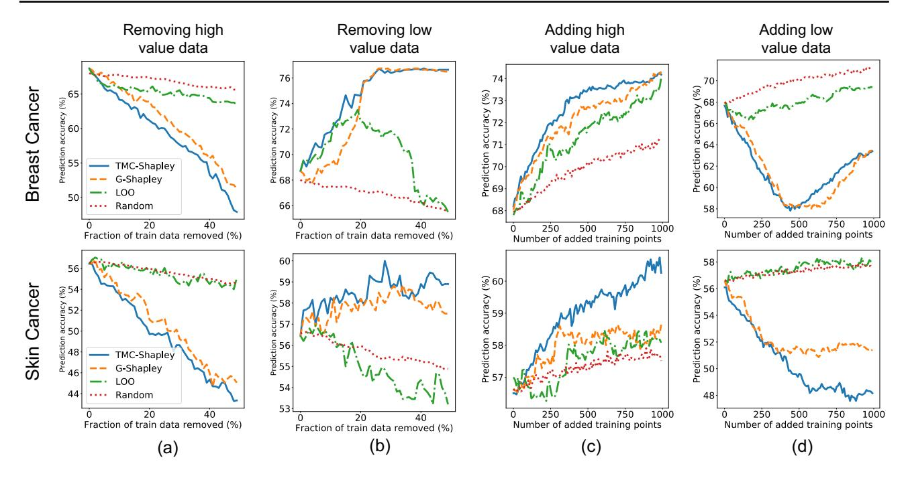
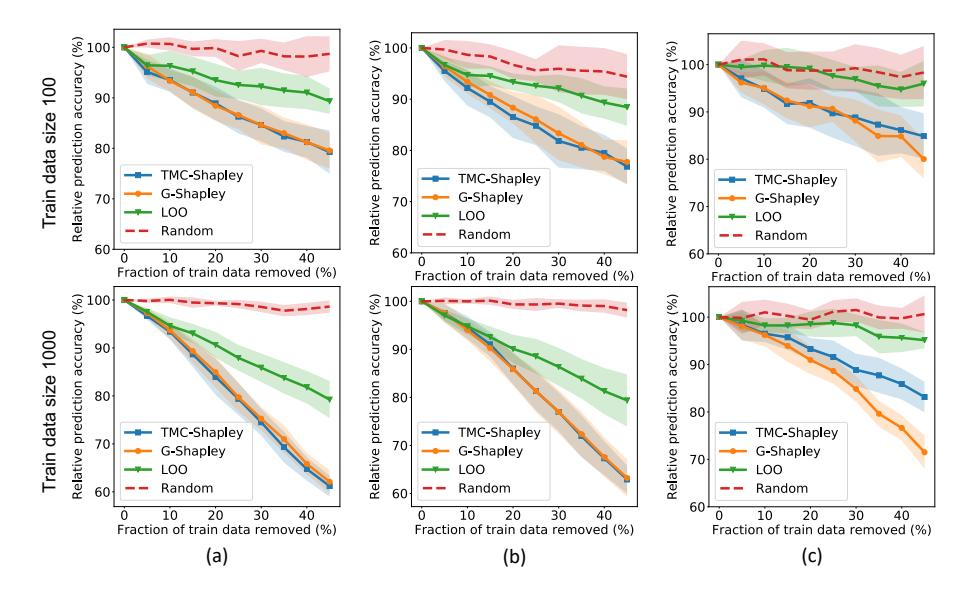
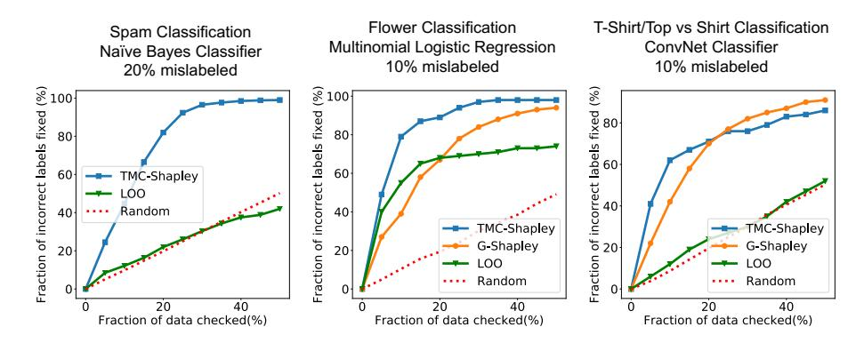
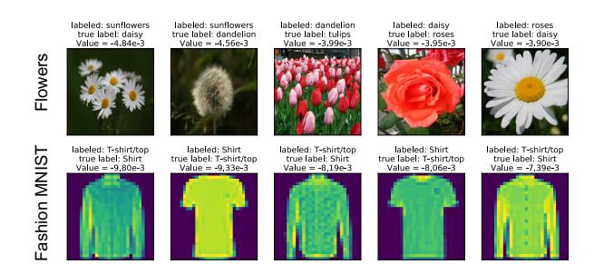
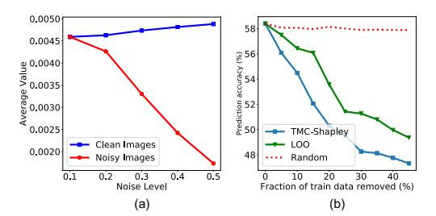

# Data Shapley: Equitable Valuation of Data for Machine Learning

### Amirata Ghorbani <sup>1</sup> James Zou <sup>2</sup>

# Abstract

As data becomes the fuel driving technological and economic growth, a fundamental challenge is how to quantify the value of data in algorithmic predictions and decisions. For example, in healthcare and consumer markets, it has been suggested that individuals should be compensated for the data that they generate, but it is not clear what is an equitable valuation for individual data. In this work, we develop a principled framework to address data valuation in the context of supervised machine learning. Given a learning algorithm trained on n data points to produce a predictor, we propose data Shapley as a metric to quantify the value of each training datum to the predictor performance. Data Shapley uniquely satisfies several natural properties of equitable data valuation. We develop Monte Carlo and gradient-based methods to efficiently estimate data Shapley values in practical settings where complex learning algorithms, including neural networks, are trained on large datasets. In addition to being equitable, extensive experiments across biomedical, image and synthetic data demonstrate that data Shapley has several other benefits: 1) it is more powerful than the popular leave-one-out or leverage score in providing insight on what data is more valuable for a given learning task; 2) low Shapley value data effectively capture outliers and corruptions; 3) high Shapley value data inform what type of new data to acquire to improve the predictor.

# 1. Introduction

Data is valuable and it is the fuel that powers artificial intelligence. Increasingly in sectors such as health care and advertising, data generated by individuals is a key compo-

*Proceedings of the* 36 th *International Conference on Machine Learning*, Long Beach, California, PMLR 97, 2019. Copyright 2019 by the author(s).

nent of the market place, similar to labor and capital (Posner & Weyl, 2018). It has been suggested that certain data constitute individual property, and as such individuals should be compensated in exchange for these data (Regulation, 2018). Like labor and capital, a fundamental question is how to equitably value individual's data.

We focus on data valuation in the specific setting of supervised machine learning. In order to make sense of data value, we need three ingredients in our investigation: a fixed training data set, a learning algorithm, and a performance metric. The training data is a fixed set of n data points, {x<sup>i</sup> , yi} n 1 , where x<sup>i</sup> and y<sup>i</sup> are the features and the label of point i, respectively. For our purpose, a learning algorithm A is a procedure that takes an arbitrary training set and produces a predictor. For example, A could be the common empirical risk minimization where it solves θ <sup>∗</sup> = arg min<sup>θ</sup> Pl(f(x<sup>i</sup> ; θ), yi), where l is the loss, θ parametrizes a family of models and f( ; θ ∗ ) is the predictor. For any predictor f, we also need a performance metric of V (f). We can think of V as the test performance of f on whatever metric of interest.

The two questions that we want to investigate are: 1) what is an equitable measure of the value of each (x<sup>i</sup> , yi) to the learning algorithm A with respect to the performance metric V ; and 2) how do we efficiently compute this data value in practical settings. For example, suppose we have data from N = 1000 patients and we train a small neural network to build a heart disease classifier. We also have some independent metric to assess the performance of the trained classifier—e.g. its prediction accuracy on a test set. Then we would like to quantify the value of each patient's data to the classifier's performance on this task.

Note that we do not define a universal value for data. Instead, the value of each datum depend on the learning algorithm, the performance metric as well as on other data in the training set. This dependency is reasonable and desirable in machine learning. Certain data points could be more important if we are training a logistic regression instead of a neural network. Similarly, if the performance metric changes—e.g. regressing to the age of heart disease onset instead of heart disease incidence—then the value of certain patient's data should change. Moreover the performance metric could be computed on a different population/distribution than the

<sup>1</sup>Department of Electrical Engineering, Stanford University, Stanford, CA, USA <sup>2</sup>Department of Biomedical Data Science, Stanford University, Stanford, CA, USA. Correspondence to: James Zou <jamesz@stanford.edu>.

training data; we make no assumptions about how it is done.

A common method to evaluate data importance is some form of leave-one-out (LOO) test: compare the difference in the predictor's performance when trained on the full dataset vs. the performance when trained on the full set minus one point (Cook, 1977). The drop in performance in one measure of the "value" of that point. LOO is often approximated by leverage or influence score, which measures how the predictor changes when the weight of one point changes slightly (Cook & Weisberg, 1982). We will show below that leave-one-out does not satisfy natural properties we expect for equitable data valuation, and it performs poorly in experiments. For a simple intuition of why leave-one-out fails, suppose our predictor is a nearest-neighbor classifier i.e. for each test point we find its nearest neighbor in the training set and assign it that label. Moreover suppose every training point has two exact copies in the training set. Removing one point from training does not change the predictor at all, since its copy is still present. Therefore the leave-one-out approach would assign every training point zero value, regardless of how well the actual predictor performs. This simple example illustrates that leave-one-out does not capture potentially complex interactions between subsets of data. Our proposed data Shapley value provides more meaningful valuation by precisely accounting for such interactions.

Our contributions We provide a natural formulation of the important problem of equitable data valuation in machine learning. We propose data Shapley value, leveraging powerful results from game theory, to quantify the the contribution of individual data points to a learning task. Data Shapley uniquely satisfies three natural properties of equitable valuation. Moreover, our empirical studies demonstrate that data Shapley has several additional utilities: 1) it gives more insights into the importance of each data point than the common leave-one-out score; 2) it can identify outliers and corrupted data; 3) it can inform how to acquire future data to improve the predictor.

# 2. Equitable Data Valuation for ML

Preliminaries Let D = {(x<sup>i</sup> , yi)} n <sup>1</sup> be our fixed training set. We do not make any distributional assumptions about D and the data need not be independent. The yi's can be categorical or real for classification and regression, respectively. Let A denote the learning algorithm. We view A as a black-box that takes as input a training data set of size between 0 and ∞, and returns a predictor. We are particularly interested in the predictor trained on subsets S ⊆ D. The performance score V is another black-box oracle that takes as input any predictor and returns a score. We write V (S, A), or just V (S) for short, to denote the performance

score of the predictor trained on data S. Our goal is to compute a data value φi(D, A, V ) ∈ R, as a function of D, A and V , to quantify the value of the i-th datum. We will often write it as φi(V ) or just φ<sup>i</sup> to simplify notation. For convenience, we will sometimes overload the notation for S and D so that it can also indicate the set of indices—i.e. i ∈ S if (x<sup>i</sup> , yi) is in that subset and D = {1, ..., n}.

Example Suppose yi's are binary and A corresponds to a logistic regression learner—i.e. A takes any dataset and returns a logistic regression fitted to it. The score V here could be the 0/1 accuracy on a separate test set. Then V (S) is the 0/1 test accuracy when the logistic regression is trained on a subset S ⊆ D. If S = ∅, then V (S) is the performance of a randomly initialized classifier. In general, the test data used to compute V could be from a different distribution than that of D.

Equitable properties of data valuation We believe that φ should satisfy the following properties in order to be equitable:

- 1. If (x<sup>i</sup> , yi) does not change the performance if it's added to any subset of the training data, then it should be given zero value. More precisely, suppose for all S ⊆ D − {i}, V (S) = V (S ∪ {i}), then φ<sup>i</sup> = 0.
- 2. If for data i and j and any subset S ⊆ D − {i, j}, we have V (S ∪ {i}) = V (S ∪ {j}), then φ<sup>i</sup> = φ<sup>j</sup> . In other words, if i and j, when added to any subset of our training data, always produce exactly the same change in the predictor's score, then i and j should be given the same value by symmetry.
- 3. In most ML settings, V = − P <sup>k</sup><sup>∈</sup>test set l<sup>k</sup> where l<sup>k</sup> is the loss of the predictor on the k-th test point (we took a minus so that lower loss is higher score). We can define V<sup>k</sup> = −l<sup>k</sup> to be the predictor's performance on the k-th test point. Similarly φi(Vk) quantifies the value of the i-th training point to the k-th test point. If datum i contributes values φi(V1) and φi(V2) to the predictions of test points 1 and 2, respectively, then we expect the value of i in predicting both test points i.e. when V = V<sup>1</sup> + V2—to be φi(V1) + φi(V2). In words: when the overall prediction score is the sum of K separate predictions, the value of a datum should be the sum of its value for each prediction. Formally: φi(V +W) = φi(V )+φi(W) for performance scores V and W.

While there are other desirable properties of data valuation worth discussing, these three properties listed above actually pin down the form of φ<sup>i</sup> up to a proportionality constant.

Proposition 2.1. *Any data valuation* φ(D, A, V ) *that satisfies properties 1-3 above must have the form*

$$\phi_i = C \sum_{S \subseteq D - \{i\}} \frac{V(S \cup \{i\}) - V(S)}{\binom{n-1}{|S|}} \tag{1}$$

*where the sum is over all subsets of* D *not containing* i *and* C *is an arbitrary constant. We call* φ<sup>i</sup> *the data Shapley value of point* i*.*

*Proof.* The expression of φ<sup>i</sup> in Eqn. 1 is the same as the Shapley value defined in game theory, up to the constant C (Shapley, 1953; Shapley et al., 1988). This motivates calling φi the data Shapley value. The proof also follows directly from the uniqueness of the game theoretic Shapley value, by reducing our problem to a cooperative game (Dubey, 1975). In cooperative game theory, there are n players and there is a score function v : 2[n] → R. Basically v(S) is the reward if the players in subset S work together. Shapley proposed a way to divide the score among the n players so that each player receives his/her fair payment, where fairness is codified by properties that are mathematically equivalent to the three properties that we listed. We can view data valuation as a cooperative game: each training datum is a player, and the training data work together through the learner A to achieve prediction score v = V . The data Shapley value is analogous to the payment that each player receives.

The choice of C is an arbitrary scaling and does not affect any of our experiments and analysis.

Interpretation of data Shapley Eqn. 1 could be interpreted as a weighted sum of all possible "marginal contributions" of i; where the weight is inverse the number of subsets of size |S| in D − {i}. This formulation is close to that of leave-one-out where instead of considering the last marginal contribution V (D) − V (D − {i}), we consider each point's marginal contribution assuming that instead of the whole training set, a random subset of it is given. In other words, we can assume the scenario where instead of the train data, we were given a random subset of it; Shapley formula outputs an equitable value by capturing all these possible subset scenarios.

# 3. Approximating Data Shapley

As discussed in the previous section, the Shapley formula in Eqn. 1 uniquely provides an equitable assignment of values to data points. Computing data Shapley, however, requires computing all the possible marginal contributions which is exponentially large in the train data size. In addition, for each S ⊆ D, computing V (S) involves learning a predictor on S using the learning algorithm A. As a consequence, calculating the exact Shapley value is not tractable for real world data sets. In this section, we discuss approximation methods to estimate the data Shapley value.

#### 3.1. Approximating Shapley Value

As mentioned, computing the Shapley value has exponential complexity in number of data points n. Here, we discuss two methods for circumventing this problem:

Monte-Carlo method: We can rewrite Eqn. 1 into an equivalent formulation by setting C = 1/n!. Let Π be the uniform distribution over all n! permutations of data points, we have:

$$\phi_i = \mathbb{E}_{\pi \sim \Pi} [V(S_{\pi}^i \cup \{i\}) - V(S_{\pi}^i)]$$
 (2)

where S i π is the set of data points coming before datum i in permutation π (S i <sup>π</sup> = ∅ if i is the first element).

As described in Eqn. 2, calculating the Shapley value can be represented as an expectation calculation problem. Therefore, Monte-Carlo method have been developed and analyzed to estimate the Shapley value (Mann & Shapley, 1962; Castro et al., 2009b; Maleki et al., 2013). First, we sample a random permutations of data points. Then, we scan the permutation from the first element to the last element and calculate the marginal contribution of every new data point. Repeating the same procedure over multiple Monte Carlo permutations, the final estimation of the data Shapley is simply the average of all the calculated marginal contributions. This Monte Carlo sampling gives an unbiased estimate of the data Shapley. In practice, we generate Monte Carlo estimates until the average has empirically converged. Previous work has analyzed error bounds of Monte-carlo approximation of Shapley value (Maleki et al., 2013). Fig 6 in Appendix A depicts examples of convergence of data Shapley. In practice, convergence is reached with number of samples on the order n; usually 3n Monte Carlo samples is sufficient for convergence.

Truncation: In the machine learning setting, V (S) for S ⊆ N is usually the predictive performance of the model learned using S on a separate test set. Because the test set is finite, V (S) is itself an approximation to the true performance of the trained model on the test distribution, which we do not know. In practice, it is sufficient to estimate the data Shapley value up to the intrinsic noise in V (S), which can be quantified by measuring variation in the performance of the same predictor across bootstrap samples of the test set (Friedman et al., 2001). On the other hand, as the size of S increases, the change in performance by adding only one more training point becomes smaller and smaller (Mahajan et al., 2018; Beleites et al., 2013). Combining these two observations lead to a natural truncation approach.

#### **Algorithm 1 Truncated Monte Carlo Shapley**

```
Input: Train data D=\{1,\ldots,n\}, learning algorithm \mathcal{A}, performance score V

Output: Shapley value of training points: \phi_1,\ldots,\phi_n

Initialize \phi_i=0 for i=1,\ldots,n and t=0

while Convergence criteria not met \mathbf{do}
t\leftarrow t+1
\pi^t: Random permutation of train data points v_0^t\leftarrow V(\emptyset,\mathcal{A})
for j\in\{1,\ldots,n\} \mathbf{do}\nif |V(D)-v_{j-1}^t|< Performance Tolerance then v_j^t=v_{j-1}^t\nelse
v_j^t\leftarrow V(\{\pi^t[1],\ldots,\pi^t[j]\},\mathcal{A})\nend if \phi_{\pi^t[j]}\leftarrow\frac{t-1}{t}\phi_{\pi^{t-1}[j]}+\frac{1}{t}(v_j^t-v_{j-1}^t)\nend for
```

We can define a "performance tolerance" based on the bootstrap variation in V. As we scan through a sampled permutation and calculate marginal contributions, we truncate the calculation of marginal contributions in a sampled permutation whenever V(S) is within the performance tolerance of V(D) and set the marginal contribution to be zero for the rest of data points in this permutation. Appendix B shows that truncation leads to substantial computational savings without introducing significant estimation bias. In the rest of the paper, we refer to the combination of truncation with Monte-Carlo as the "Trunctated Monte Carlo Shapley" (TMC-Shapley); described with more details in Algorithm 1.

### **3.2.** Approximating Performance Metric V

For every  $S \subseteq D$ , calculating V(S) requires  $\mathcal{A}$  to learn a new model. For a small D and a fast  $\mathcal{A}$ —e.g. logistic regression, LASSO—it is possible to use the TMC-Shapley method as stated. However, in settings where the number of data points is large or the predictive model requires high computational power (e.g. deep neural networks), applying TMC-Shapley can be quite expensive. We propose two strategies to further reduce the computational cost of data Shapley for large data settings.

**Gradient Shapley** For a wide family of predictive models,  $\mathcal{A}$  involves a variation of stochastic gradient descent where randomly selected batches of D update the model parameters iteratively. One simple approximation of a completely trained model in these settings is to consider training the model with only one pass through the training data; in other words, we train the model for one "epoch" of D. This

### **Algorithm 2 Gradient Shapley**

```
Input: Parametrized and differentiable loss function \mathscr{L}(.;\theta), train data D=\{1,\ldots,n\}, performance score function V(\theta)
Output: Shapley value of training points: \phi_1,\ldots,\phi_n
Initialize \phi_i=0 for i=1,\ldots,n and t=0
while Convergence criteria not met \operatorname{do}
t\leftarrow t+1
\pi^t: Random permutation of train data points \theta_0^t\leftarrow \operatorname{Random} parameters v_0^t\leftarrow V(\theta_0^t)
for j\in\{1,\ldots,n\} do
\theta_j^t\leftarrow\theta_{j-1}^t-\alpha\nabla_\theta\mathscr{L}(\pi^t[j];\theta_{j-1})
v_j^t\leftarrow V(\theta_j^t)
\phi_{\pi^t[j]}\leftarrow\frac{t-1}{t}\phi_{\pi^{t-1}[j]}+\frac{1}{t}(v_j^t-v_{j-1}^t)\nend for
```

approximation fits nicely within the framework of Algorithm 1: for a sampled permutation of data points, update the model by performing gradient descent on one data point at a time; the marginal contribution is the change in model's performance. Details are described in Algorithm 2, which we call Gradient Shapley or G-Shapley for short. In order to have the best approximation, we perform hyper-parameter search for the learning algorithm to find the one resulting best performance for a model trained on only one pass of the data which, in our experiments, result in learning rates bigger than ones used for multi-epoch model training. Appendix D discusses numerical examples of how good of an approximation G-Shapley method yields in this work's experimental results.

Value of groups of data points In many settings, in order to have more robust interpretations or because the training set is very large, we prefer to compute the data Shapley for groups of data points rather than for individual data. For example, in a heart disease prediction setting, we could group the patients into discrete bins based on age, gender, ethnicity and other features, and then quantify the data Shapley of each bin. In these settings, we can calculate the Shapley value of a group using the same procedure as Algorithm 1, replacing the data point i by group i. As a consequence, even for a very large data set, we can calculate the group Shapley value if the number of groups is reasonable.

#### 4. Experiments & Applications

In this section, we demonstrate the estimation and applications of data Shapley across systematic experiments on real and synthetic data. We show that points with high Shapley value are critical for model's performance and vice versa. We then discuss the effect of acquiring new data points similar to highly valued training points compared to acquiring new data randomly. Moreover we conduct two experiments showing that data points that are noisy or have label corruption will be assigned low Shapley value. Lastly we demonstrate that Shapley values can also give informative scores for groups of individuals. Taken together, these experiments suggest that, in addition to its equitable properties, data Shapley provides meaningful values to quantify the importance of data and can inform downstream analysis. Given that leverage and influence scores seek to approximate leave-one-out score (Koh & Liang, 2017), throughout the experiments, we focus on comparing the performance of the Shapley methods to that of the leave-one-out (LOO) method. LOO is computed as the difference in the model performance V between the model trained on the full dataset with and without the point of interest.

In all of the following experiments, we have a train set, a separate test set used for calculating V, and a held-out set used for reporting the final results of each figure. Our convergence criteria for TMC-Shapley and G-Shapley is  $\frac{1}{n}\sum_{i=1}^{n}\frac{|\phi_i^t-\phi_i^{t-100}|}{|\phi_i^t|}<0.05.$  For all the experiments, calculating data Shapley values took less than 24 hours on four machines running in parallel (each with 4 cpus) except for one of the experiments where the model is a Conv-Net for which 4 GPUs were utilized in parallel for 120 hours. It should be mentioned that both data Shapley algorithms are parallelizable up to the number of iterations and therefore, the computations can become faster using more machines in parallel.

### 4.1. Data Shapley for Disease Prediction

In this experiment, we use the UK Biobank data set (Sudlow et al., 2015); the task is predicting whether an individual will be diagnosed with Malignant neoplasm of breast and skin (ICD10 codes C50 and C44, binary classification) using 285 features. Balanced binary data sets for each task are created and we use 1000 individuals for the task of training. Logistic regression yields a test accuracy of 68.7% and 56.4% for breast and skin cancer prediction, respectively. Performance is computed as the accuracy of trained model on 1000 separate patients. The varying accuracies for the two tasks allow us to investigate data Shapley for classifiers that are more or less accurate. We first compute the TMC-Shapley, G-Shapley, and leave-one-out values. The TMC-Shapley converges in 4000 Monte Carlo iterations for both tasks while G-Shapley is already converged at iteration 1500. Appendix A shows examples of convergence for randomly selected data points in the train sets.

**Importance of valuable datum** After calculating data values, we remove data points from the training set starting

from the most valuable datum to the least valuable and train a new model each time. Fig. 1(a) shows the change in the performance as valuable data points are thrown away; points that data Shapley considers valuable are crucially important for the model performance while leave-one-out valuation is only slightly better than random valuation (i.e. removing random points). Fig. 1(b) depicts the results for the opposite setting; we remove data points starting from the least valuable. Interestingly points with low Shapley value in these training set actually harm the model's performance and removing them will improve accuracy.

Acquiring new data Looking at which type of train data have high Shapley value and inform us how to collect new data—by recruiting similar individuals—in order to improve the model performance. Let's consider the following practical scenario: we want to add a number of new patients to the training data to improve our model. Adding an individual carries a cost, so we have to choose among a pool of 2000 candidates. We run two experiments: first we try to add points that are similar to high value training points and then we repeat the same experiment by adding low value points. To this end, we fit a Random Forest regression model to the calculated data Shapley values. The regression model learns to predict a data point's value given its observables. Using the trained regression model, we estimate the value of patients in the patient pool. Fig. 1(c) depicts how the model performance changes as we add patients with high estimated value to our training set; the model's performance increases more effectively than adding new patients randomly. Considering the opposite case, Fig. 1(d) shows that by choosing the wrong patients to add, we can actually hurt the current model's performance.

### 4.2. Synthetic Data

We use synthetic data to further analyze Shapley values. The data generating process is as follows. First, features are sampled from a 50-dimensional Gaussian distribution  $\mathcal{N}(0,I)$ . Each sample i's label is then assigned a binary label  $y_i$  where  $P(y_i = 1) = f()$  for a function f(.). We create to sets of data sets: 20 data sets were feature-label relationship is linear (linear f(.)), and 20 data sets where f(.) is a third order polynomial. For the first sets of data set we us a logistic regression model and for the second set we use both a logistic regression and a neural network with one hidden layer. We then start removing training points from the most valuable to the least valuable and track the change in model performance. Fig. 2 shows the results for using train data size of 100 and 1000; for all of the settings, the Shapley valuation methods do a better job than the leaveone-out in determining datum with the most positive effect on model performance. Note here that Shapley value is always dependent on the chosen model: in a dataset with



Figure 1. Disease Prediction For breast and skin cancer prediction tasks, we calculate the value of every point in the train set using TMC-Shapley, G-Shapley and leave-one-out (LOO). (a) We remove the most valuable data from the train set, as ranked by the three methods plus uniform sampling. The Shapley methods identifies important data points, and removing the most TMC-Shapley or G-Shapley valuable points results in performance worse than randomly removing data. This is not true for LOO. (b) Removing the low TMC-Shapley or G-Shapley value data from the train set improves the predictor performance. (c) We acquired new patients who are similar to the high TMC-Shapley or G-Shapley value patients in the training data. This resulted in greater performance gains compared to adding random patients. (d) Acquiring new patients who are similar to low TMC-Shapley or G-Shapley value patients do not help.

non-linear feature-label relationship, data points that will improve a non-linear model's performance, can be harmful to a linear model and therefore valueless.

### 4.3. Label Noise

Labeling data sets using crowd-sourcing is susceptible to mistakes (Frenay & Verleysen ´ , 2014) and mislabeling the data can be used as a simple data poisoning method (Steinhardt et al., 2017). In this experiment, given a train data with noisy labels, we check and correct the mislabeled examples by inspecting the data points from the least valuable to the most valuable as we expect the mislabeled examples to be among the lowest valuable points (some have negative Shapley value). Fig. 3 shows the effectiveness of this method using TMC-Shapley, Gradient-Shapley (If applicable), and leave-one-out methods compared to the random inspection benchmark. We run the experiment for three different data sets and three different predictive models. In the first experiment, we use the spam classification data set (Metsis et al., 2006). 3000 data points are used for training a Multinomial Naive Bayes model that takes the bag of words representation of emails as input. We randomly flip the label for 20% of training points. TMC-Shapley converges in 5000

iterations.In the next experiment, we use the flower image classification data set<sup>1</sup> with 5 different classes. We pass the flower images through Inception-V3 model and train a multinomial logistic regression model on the learned network's representation of 1000 images where 10% of the images are mislabeled. Both Shapley algorithms converge in 2000 iterations. At last, we train a convolutional neural network with one convolutional and two feed-forward layers on 1000 images from the Fashion MNIST data set(Xiao et al., 2017) to classify T-Shirts and Tops against Shirts. 10% of data points have flipped labels. TMC-Shapley and G-Shapley both converge in 2000 iterations. The value is computed on separate sets of size 1000. Fig. 3 displays the results. Fig 4 shows the 5 least TMC-Shapley valued images for Flowers and Fashion MNIST data sets where all are mislabeled examples.

### 4.4. Data Quality and Value

In this experiment, we used the Dog vs. Fish data set introduced in (Koh & Liang, 2017). For each class, 1200 images are extracted from Imagenet (Russakovsky et al., 2015). We

<sup>1</sup> adapted from https://goo.gl/Xgr1a1



Figure 2. Synthetic experiments Average results are displayed for three different settings. Vertical axis if relative accuracy which stands for accuracy divided by the accuracy of the model trained on the whole train data without any removal. For each figure, 20 data sets are used. In all data sets, the generative prorcess is as follows: for input features , the label is generated such that p(y|x) = f(x) where in (a) f(.) is linear and in (b) f(.) is a third order polynomial and (c) uses the same data sets as (b). In (a) and (b) the model is logistic regression and in (c) it's a neural network. Both Shapley methods do a better job at assigning high value to data points with highest positive effect on model performance. Colored shaded areas stand for standard deviation over results of 20 data sets.

use a state of the art Inception-v3 network(Szegedy et al., 2016) with all layers but the top layer frozen. 100 images are randomly sampled as the training set and 1000 images are used to compute the value function. We corrupt 10% of train data by adding white noise and compute the average TMC-Shapley value of clean and noisy images and repeat the same experiment with different levels of noise. As it is shown in Fig. 5(a), as the noise level increases (the data quality drops), the data Shapley value of the noisy images decreases.

### 4.5. Group Shapley Value

In this experiment, we use a balanced subset of the hospital readmission data set (Strack et al., 2014) for binary prediction of a patient's readmission. We group patients into 146 groups by intersections of demographic features of gender, race, and age. A gradient boosting classifier trained on a train set of size 60000 yields and accuracy of 58.4%. We then calculate the TMC-Shapey values of groups. Fig 5(b) shows that the most valuable groups are also the most important ones for model's performance. In addition to computational efficiency, an important advantage of group Shapley is its easy interpretations. For instance, in this data set, groups of older patients have higher value than younger ones, racial minorities get less value, and groups of females tend to be more valuable than males with respect to data Shapley, and so forth.

# 5. Related Works

Shapley value was proposed in a classic paper in game theory (Shapley, 1953) and has been widely influential in economics (Shapley et al., 1988). It has been applied to analyze and model diverse problems including voting, resource allocation and bargaining (Milnor & Shapley, 1978; Gul, 1989). To the best of our knowledge, Shapley value has not been used to quantify data value in a machine learning context like ours. Shapley value has been recently proposed as a feature importance score for the purpose of interpreting black-box predictive models (Kononenko et al., 2010; Datta et al., 2016; Lundberg & Lee, 2017; Cohen et al., 2007; Chen et al., 2018; Lundberg et al., 2018). Their goal is to quantify, for a given prediction, which features are the most influential for the model output. Our goal is very different in that we aim to quantify the value of individual data points (not features). There is also a literature in estimating Shapley value using Monte Carlo methods, network approximations, as well as analytically solving Shapley value in specialized settings (Fatima et al., 2008; Michalak et al., 2013; Castro et al., 2009a; Maleki et al., 2013; Hamers et al., 2016)

In linear regression, Cook's Distance measures the effect of deleting one point on the regression model (Cook, 1977). Leverage and influence are related notions that measures how perturbing each point affects the model parameters and model predictions on other data (Cook & Weisberg, 1982; Koh & Liang, 2017). These methods, however, do not



Figure 3. Correcting Flipped Labels We inspect train data points from the least valuable to the most valuable and fix the mislabeled examples. As it is shown, Shapley value methods result in the earliest detection of mislabeled examples. While leave-one-out works reasonably well on the Logistic Regression model, it's performance on the two other models is similar to random inspection.



Figure 4. Label noise and Shapley value Images with the least TMC-Shapley value. All of them are mislabeled.

satisfy any equitability conditions, and also have been shown to have robustness issues (Ghorbani et al., 2017). In the broad discourse, value of data and how individuals should be compensated has been intensely discussed by economists and policy makers along with the discussion of incentivizing participants to generate useful data.(Arrieta Ibarra et al., 2017; Posner & Weyl, 2018)

# 6. Discussion

We proposed data Shapley as an equitable framework to quantify the value of individual training datum for the learning algorithm. Data Shapley uniquely satisfies three natural properties of equitable data valuation. There are ML settings where these properties may not be desirable and perhaps other properties need to be added. It is a very important direction of future work to clearly understand these different scenarios and study the appropriate notions of data value. Drawing on the connections from economics, we believe the three properties we listed is a reasonable starting point. While our experiments demonstrate several desirable features of data Shapley, we should interpret it with care. Due to the space limit, we have skipped over many important



Figure 5. (a) Value and data quality: White noise is added to 10% of training points. As the noise level increases, the average TMC-Shapley value of noisy images becomes decreases compared to that of clean images. (b) Group Shapley: Removing the valuable groups degrades the performance more than removing groups with the highest leave-one-out score.

considerations about the intrinsic value of personal data, and we focused on valuation in the very specific context of training set for supervised learning algorithms. We acknowledge that there are nuances in the value of data—e.g. privacy, personal association—not captured by our framework. Moreover we do not propose that people should be exactly compensated by their data Shapley value; we believe data Shapley is more useful for the quantitative insight it provides.

In the data Shapley framework, the value of individual datum depends on the learning algorithm, evaluation metric as well as other data points in the training set. Therefore when we discuss data with high (or low) Shapley value, all of this context is assumed to be given. A datum that is not valuable for one context could be very valuable if the context changes. Understanding how data Shapley behaves for different learning functions and metrics is an interesting direction of follow up work.

# References

- Arrieta Ibarra, I., Goff, L., Jimenez Hern ´ andez, D., Lanier, ´ J., and Weyl, E. G. Should we treat data as labor? moving beyond'free'. *Moving Beyond'Free'(December 27, 2017). American Economic Association Papers & Proceedings*, 1(1), 2017.
- Beleites, C., Neugebauer, U., Bocklitz, T., Krafft, C., and Popp, J. Sample size planning for classification models. *Analytica chimica acta*, 760:25–33, 2013.
- Castro, J., Gomez, D., and Tejada, J. Polynomial calculation ´ of the shapley value based on sampling. *Computers & Operations Research*, 36(5):1726–1730, 2009a.
- Castro, J., Gomez, D., and Tejada, J. Polynomial calculation ´ of the shapley value based on sampling. *Computers & Operations Research*, 36(5):1726–1730, 2009b.
- Chen, J., Song, L., Wainwright, M. J., and Jordan, M. I. Lshapley and c-shapley: Efficient model interpretation for structured data. *arXiv preprint arXiv:1808.02610*, 2018.
- Cohen, S., Dror, G., and Ruppin, E. Feature selection via coalitional game theory. *Neural Computation*, 19(7): 1939–1961, 2007.
- Cook, R. D. Detection of influential observation in linear regression. *Technometrics*, 19(1):15–18, 1977.
- Cook, R. D. and Weisberg, S. *Residuals and influence in regression*. New York: Chapman and Hall, 1982.
- Datta, A., Sen, S., and Zick, Y. Algorithmic transparency via quantitative input influence: Theory and experiments with learning systems. In *Security and Privacy (SP), 2016 IEEE Symposium on*, pp. 598–617. IEEE, 2016.
- Dubey, P. On the uniqueness of the shapley value. *International Journal of Game Theory*, 4(3):131–139, 1975.
- Fatima, S. S., Wooldridge, M., and Jennings, N. R. A linear approximation method for the shapley value. *Artificial Intelligence*, 172(14):1673–1699, 2008.
- Frenay, B. and Verleysen, M. Classification in the presence ´ of label noise: a survey. *IEEE transactions on neural networks and learning systems*, 25(5):845–869, 2014.
- Friedman, J., Hastie, T., and Tibshirani, R. *The elements of statistical learning*, volume 1. Springer series in statistics New York, NY, USA:, 2001.
- Ghorbani, A., Abid, A., and Zou, J. Interpretation of neural networks is fragile. *arXiv preprint arXiv:1710.10547*, 2017.

- Gul, F. Bargaining foundations of shapley value. *Econometrica: Journal of the Econometric Society*, pp. 81–95, 1989.
- Hamers, H., Husslage, B., Lindelauf, R., Campen, T., et al. A new approximation method for the shapley value applied to the wtc 9/11 terrorist attack. Technical report, 2016.
- Koh, P. W. and Liang, P. Understanding black-box predictions via influence functions. *arXiv preprint arXiv:1703.04730*, 2017.
- Kononenko, I. et al. An efficient explanation of individual classifications using game theory. *Journal of Machine Learning Research*, 11(Jan):1–18, 2010.
- Lundberg, S. M. and Lee, S.-I. A unified approach to interpreting model predictions. In *Advances in Neural Information Processing Systems*, pp. 4765–4774, 2017.
- Lundberg, S. M., Erion, G. G., and Lee, S.-I. Consistent individualized feature attribution for tree ensembles. *arXiv preprint arXiv:1802.03888*, 2018.
- Mahajan, D., Girshick, R., Ramanathan, V., He, K., Paluri, M., Li, Y., Bharambe, A., and van der Maaten, L. Exploring the limits of weakly supervised pretraining. *arXiv preprint arXiv:1805.00932*, 2018.
- Maleki, S., Tran-Thanh, L., Hines, G., Rahwan, T., and Rogers, A. Bounding the estimation error of samplingbased shapley value approximation. *arXiv preprint arXiv:1306.4265*, 2013.
- Mann, I. and Shapley, L. S. Values of large games. 6: Evaluating the electoral college exactly. Technical report, RAND CORP SANTA MONICA CA, 1962.
- Metsis, V., Androutsopoulos, I., and Paliouras, G. Spam filtering with naive bayes-which naive bayes? In *CEAS*, volume 17, pp. 28–69. Mountain View, CA, 2006.
- Michalak, T. P., Aadithya, K. V., Szczepanski, P. L., Ravindran, B., and Jennings, N. R. Efficient computation of the shapley value for game-theoretic network centrality. *Journal of Artificial Intelligence Research*, 46:607–650, 2013.
- Milnor, J. W. and Shapley, L. S. Values of large games ii: Oceanic games. *Mathematics of operations research*, 3 (4):290–307, 1978.
- Posner, E. A. and Weyl, E. G. *Radical Markets: Uprooting Capitalism and Democracy for a Just Society*. Princeton University Press, 2018.
- Regulation, P. General data protection regulation. *IN-TOUCH*, 2018.

- Russakovsky, O., Deng, J., Su, H., Krause, J., Satheesh, S., Ma, S., Huang, Z., Karpathy, A., Khosla, A., Bernstein, M., et al. Imagenet large scale visual recognition challenge. *International Journal of Computer Vision*, 115(3): 211–252, 2015.
- Shapley, L. S. A value for n-person games. *Contributions to the Theory of Games*, 2(28):307–317, 1953.
- Shapley, L. S., Roth, A. E., et al. *The Shapley value: essays in honor of Lloyd S. Shapley*. Cambridge University Press, 1988.
- Steinhardt, J., Koh, P. W. W., and Liang, P. S. Certified defenses for data poisoning attacks. In *Advances in Neural Information Processing Systems*, pp. 3517–3529, 2017.
- Strack, B., DeShazo, J. P., Gennings, C., Olmo, J. L., Ventura, S., Cios, K. J., and Clore, J. N. Impact of hba1c measurement on hospital readmission rates: analysis of 70,000 clinical database patient records. *BioMed research international*, 2014, 2014.
- Sudlow, C., Gallacher, J., Allen, N., Beral, V., Burton, P., Danesh, J., Downey, P., Elliott, P., Green, J., Landray, M., et al. Uk biobank: an open access resource for identifying the causes of a wide range of complex diseases of middle and old age. *PLoS medicine*, 12(3):e1001779, 2015.
- Szegedy, C., Vanhoucke, V., Ioffe, S., Shlens, J., and Wojna, Z. Rethinking the inception architecture for computer vision. In *Proceedings of the IEEE conference on computer vision and pattern recognition*, pp. 2818–2826, 2016.
- Xiao, H., Rasul, K., and Vollgraf, R. Fashion-mnist: a novel image dataset for benchmarking machine learning algorithms. *arXiv preprint arXiv:1708.07747*, 2017.